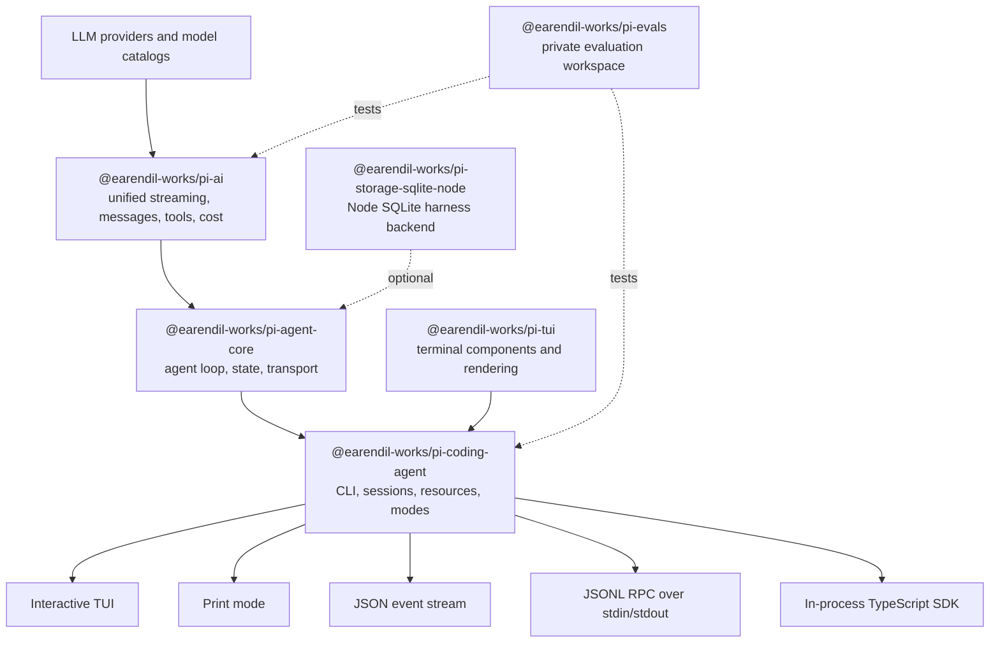
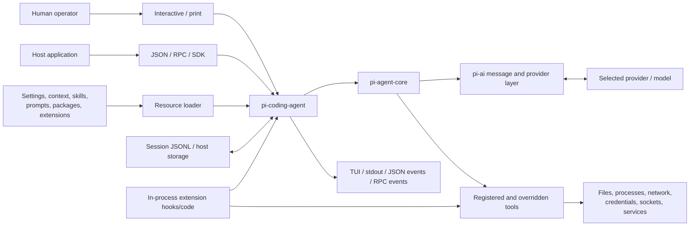
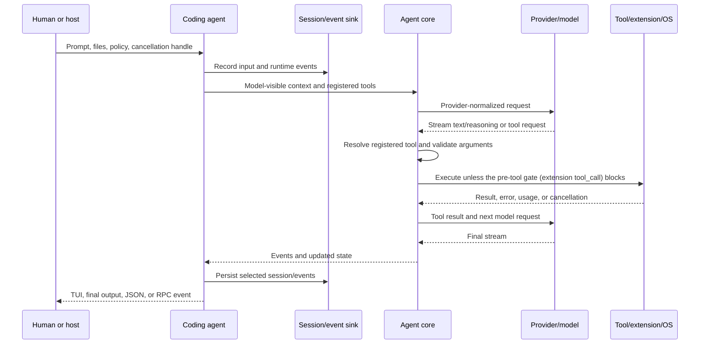
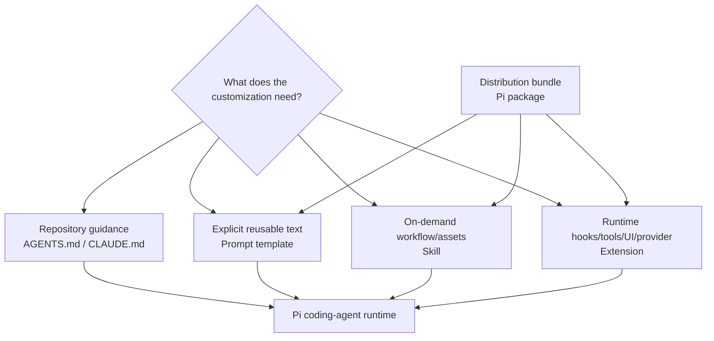
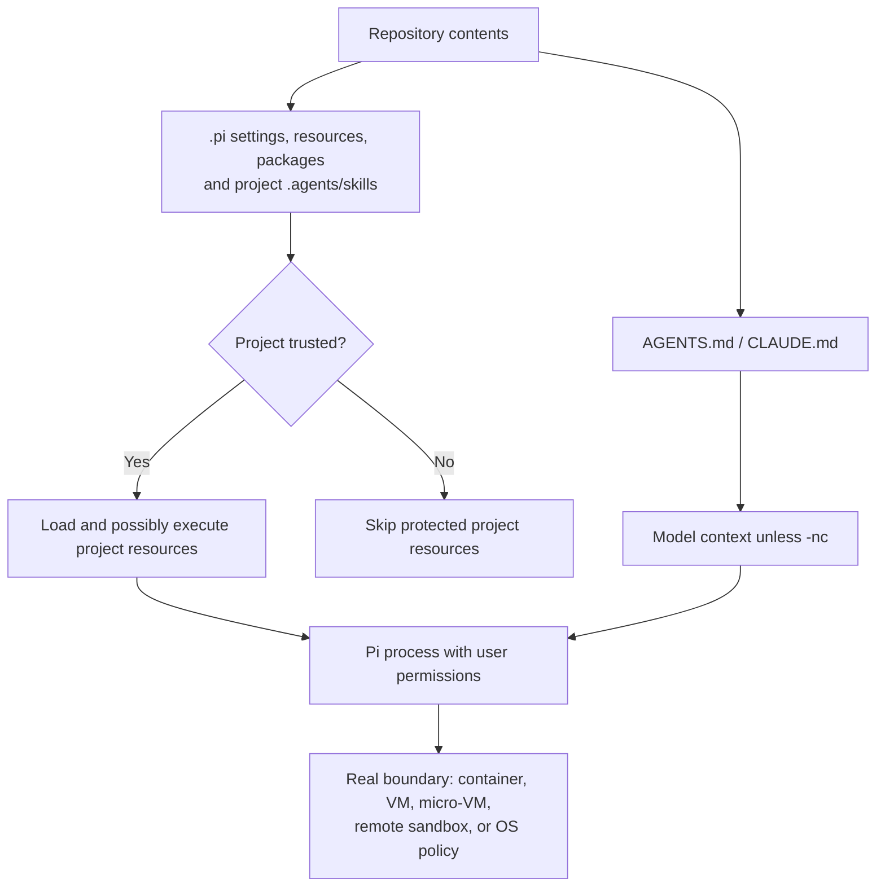

[English](./architecture.md) | [简体中文](./architecture.zh-CN.md)

# Pi architecture and customization decisions

<!-- sync:architecture-snapshot -->

This map separates the stable v0.83.0 release from post-release development.
Pi moves quickly: the researched `main` snapshot was 56 commits ahead of the
v0.83.0 tag only two days after the release commit. Use version-pinned source
links for implementation work and `latest` documentation for discovery.

<!-- sync:architecture-layers -->

## Packages and code present in the v0.83.0 source tree



| Layer | Use it when | Do not assume |
| --- | --- | --- |
| `pi-ai` | You need provider-normalized streaming, tool schemas, images, reasoning, usage, or cross-provider message conversion. | Provider abstractions are lossless; upstream documents several best-effort conversions. |
| `pi-agent-core` | You need an agent loop, state, attachments, event streaming, or a transport abstraction without the coding CLI. | It provides the coding-agent session UX or project resource discovery. |
| `pi-coding-agent` | You want the ready CLI, extensions, skills, prompts, packages, sessions, SDK, JSON mode, or RPC mode. | Its project trust prompt is a sandbox. |
| `pi-tui` | You are building terminal components or custom extension UI. | TUI behavior is identical in every terminal emulator. |
| `pi-storage-sqlite-node` | You embed the agent core and need the Node SQLite session store. | It replaces the coding agent's JSONL session semantics automatically. |
| `@earendil-works/pi-evals` | You are studying or running the private evaluation workspace in the pinned source tree. | It is a published, supported benchmarking product or proof that a workflow is better. |
| `@earendil-works/pi-server` | You are researching the upstream experimental server. | Its CLI, API, or behavior is stable; its README explicitly says otherwise. |

The upstream root README's “All Packages” table lists four primary packages:
`pi-ai`, `pi-agent-core`, `pi-coding-agent`, and `pi-tui`. The v0.83.0 source
tree also contains the optional SQLite storage package, a private evaluation
workspace, and install artifacts. `@earendil-works/pi-server` is present but
explicitly experimental.

<!-- sync:architecture-runtime -->

## System context and runtime data flow

The diagram below is a control model, not an exact call graph. It shows which
component owns each boundary during a coding-agent run.



A single tool-using turn has two loops: the model loop and the durable record
loop. Extension hooks may observe or alter several stages, so the diagram must
not be read as an extension security boundary.



| Data asset | Created or selected by | Possible destination | Main handling question |
| --- | --- | --- | --- |
| Prompt, attached files, context and skill text | Human/host and resource loader | Model provider, session, event consumer | Is every item authorized for that provider and retention path? |
| Provider/model credential | Operator, login flow or host | Pi/provider process and child environment where exposed | Is it scoped, short-lived, redacted and revoked when the trial ends? |
| Tool arguments/results | Model, tool and extensions | OS/service, model context, session/event output | Are side effects, output bounds and sensitive fields declared? |
| Session JSONL and compaction entries | Coding agent or host | Session directory, export, backup, share service | What is retained, who can read it and how is it deleted? |
| stdout, stderr and debug/full logs | CLI, extensions, child processes | Terminal, CI log, collector, artifact store | Can output reveal paths, source, credentials or provider metadata? |
| Package/cache/native artifacts | Package manager and lifecycle scripts | User/project directories and execution paths | Which exact artifact ran, what remains after removal and how is it rolled back? |

<!-- sync:architecture-main-only -->

## Main-only experimental protocol

The experimental server already existed in v0.83.0. At `main@9b50b046…`, the
repository also contains `@earendil-works/pi-protocol`, a transport-neutral
framed-CBOR protocol added after the v0.83.0 tag:

- protocol version 2 frames one definite-length CBOR item with a four-byte
  unsigned big-endian length;
- the first client message is `hello` with a protocol version and bearer token;
- snapshots are authoritative, while progress events are transient;
- the package declares no compatibility guarantee.

This is **not** the same interface as `pi --mode rpc`. The v0.83.0 released CLI
RPC uses newline-delimited JSON over stdin/stdout. A client written for one
cannot speak the other.

<!-- sync:architecture-resources -->

## Resource and instruction layers



These layers are complementary, not a power ranking:

| Need | Smallest suitable primitive | Reason |
| --- | --- | --- |
| Repository conventions and commands | `AGENTS.md` | Loaded as project context; easy to review in Git. |
| A reusable prompt with arguments | Prompt template | Expands on explicit slash-command use; no runtime code. |
| A specialized workflow with scripts or references | Skill | Progressive disclosure; full instructions load on demand. |
| Lifecycle interception, a tool, UI, provider, or policy | Extension | Runs TypeScript in-process and has event/API access. |
| Share multiple resources | Pi package | Bundles extensions, skills, prompts, and themes through npm, Git, or a local path. |
| Embed in a TypeScript application | SDK | Direct access to sessions, resources, tools, and events. |
| Integrate a non-Node process | v0.83.0 CLI RPC mode | Strict JSONL request, response, and event protocol over stdio. |
| Consume events without two-way control | JSON mode | Machine-readable event stream for one run. |

**Inference:** prefer the least powerful layer that meets the need. This reduces
ambient code execution, review surface, startup coupling, and upgrade risk.

<!-- sync:architecture-startup -->

## Startup, settings, and resource-loading controls

This sequence focuses on control-relevant checkpoints. It intentionally avoids
claiming a stable internal call order beyond the behavior documented for
v0.83.0.

```mermaid
sequenceDiagram
  participant CLI as CLI or host options
  participant SM as Settings/resource manager
  participant G as User/global and CLI extensions
  participant T as Project Trust decision
  participant P as Project resources
  participant R as Runtime/session
  CLI->>SM: cwd, mode, flags, paths, session/model choices
  SM->>G: Load user/global and explicit CLI -e extensions for pre-trust
  G-->>T: First project_trust handler may return a decision
  SM->>T: Resolve saved decision, one-run override, extension decision, or fallback
  alt project trusted
    T->>P: Enable project settings/packages/resources
  else project not trusted
    T-->>P: Skip protected project resources
  end
  Note over SM,R: Context files are Trust-independent unless -nc; relative order is not an API
  SM->>R: Assemble final allowed resources and start mode/model/tools/session
```

The resulting sources are not one linear “configuration file precedence”
chain. They have different merge and trust rules:

| Source | Typical location or flag | Project Trust? | Can execute or direct execution? | Key rule |
| --- | --- | --- | --- | --- |
| Global settings/resources | `~/.pi/agent/` | No project decision required | Global extensions execute; skills/prompts direct model work | Treat the user profile as part of the run envelope, not a clean default. |
| Context files | Global, ancestor and cwd `AGENTS.md`/`CLAUDE.md` | No; discovered unless `-nc` | Text can influence model/tool choices | Declining Project Trust alone does not remove them. |
| Explicit CLI resources | `-e`, `--skill`, `--prompt-template`, `--theme` | Explicitly selected; `-e` may load before project trust | Extensions execute in process | Record exact paths/specs; `--no-*` plus explicit flags creates a narrow set. |
| Project settings/resources | `.pi/settings.json`, `.pi/`, project packages, `.agents/skills` | Yes | May install dependencies, execute extensions or direct tools | Non-interactive modes cannot ask; state `--approve` or `--no-approve`. |
| Session/history | `--session`, `--fork`, `-c`, `-r`, default session directory | Separate from Project Trust | Prior model/tool content affects later turns | Use `--no-session` for intentional ephemerality. |
| Host/CLI policy | Mode, model, tool/resource flags, cwd, timeouts, host callbacks | Host-owned | Can narrow or expand the actual run | Persist the effective choice in a run manifest. |

Documented v0.83.0 precedence facts include:

- project settings override global settings, while nested objects are merged;
- `--session-dir` overrides `PI_CODING_AGENT_SESSION_DIR`, which overrides the
  session directory setting;
- `--approve` and `--no-approve` override Project Trust for one run;
- resource `--no-*` flags can be combined with explicit resource paths to load
  only the named items.

Do not generalize those examples into an undocumented universal precedence
rule. When behavior matters, preserve the two settings files, CLI arguments and
startup resource list in the reproduction. See the pinned
[settings source](https://github.com/earendil-works/pi/blob/845d6ff1f6643aba440341cce877ce1c43ebbc39/packages/coding-agent/docs/settings.md).

<!-- sync:architecture-trust -->

## Trust and execution boundary

Project trust decides whether Pi may load project-local settings, packages,
skills, prompts, themes, system prompt files, and extensions. It does not limit
what built-in tools, the model, or already-loaded extensions can do.

Important edge cases:

- `AGENTS.md` and `CLAUDE.md` are context files and load regardless of a declined
  project trust decision unless context loading is disabled.
- user/global extensions and explicit CLI `-e` extensions load before project
  trust is resolved and can handle the trust event;
- non-interactive modes cannot display the trust prompt; without a saved
  decision, `ask` and `never` skip protected project resources, while `always`
  loads them;
- `--approve` and `--no-approve` override project trust for one run;
- extensions execute with the Pi process's user permissions;
- packages may install dependencies, and skills may instruct the model to run
  executables.



For untrusted or unattended work, the meaningful boundary is outside Pi:
container, VM, micro-VM, remote sandbox, or policy-controlled sandbox with
minimal files, credentials, and network access.

<!-- sync:architecture-threats -->

## Threat model and control placement

The useful question is not “Is Pi safe?” but “Which actor can cause which
effect through which surface, and where is that effect actually blocked?”

| Threat or failure | Entry surface | Potential effect | Control that belongs outside prompt text | Verification probe |
| --- | --- | --- | --- | --- |
| Malicious repository instruction | Context file, source, issue text or tool output | Prompt injection, unsafe tool choice, data disclosure | Disable/review context, least tools, OS/service containment | Compare `-nc --no-approve` with the original directory and inspect changed behavior. |
| Malicious or compromised extension/package | In-process code, install script, dependency, binary | Arbitrary user-level file/process/network/credential access | Pin/source review, disposable environment, restricted mounts/network/identity | Inventory processes, files, hosts and persistent paths during install/start/shutdown. |
| Model mistake or over-broad task | Tool call or host API | Out-of-scope edit, deletion, external mutation | Narrow service credential, filesystem boundary, staged human gate, recoverable baseline | Use a canary/dry run and verify that an out-of-scope action is denied. |
| Secret or private-source leakage | Prompt, attachment, command output, session/export/log | Provider or third-party retention, public artifact | Data classification, redaction, separate test data, retention/deletion policy | Search sanitized artifacts and inspect configured outbound destinations. |
| Supply-chain substitution | Moving npm/Git ref, registry account, lifecycle download | Different code executes on reinstall/update | Exact version/commit, integrity/provenance, lockfile, controlled update | Reinstall in a clean environment and compare resolved ref/hash/dependency graph. |
| Retry/cancellation failure | Provider retry, agent retry, child process, RPC host | Cost/latency amplification, duplicate side effect, orphan process | Single retry owner, idempotency key where supported, timeout and process supervision | Force timeout/cancel and check finite attempts plus child/process cleanup. |
| Session or share exposure | JSONL, HTML export, gist/share link, backup | Long-lived disclosure of prompts, code and tool results | Minimal retention, access review, redaction and deletion procedure | Locate every copy/link and confirm access/revocation behavior before sharing. |
| Host escape through exposed surfaces | Mounted socket, broad home mount, SSH agent, cloud metadata/network | Control of host or unrelated infrastructure | Do not expose the surface; use a stronger VM/micro-VM/service boundary | From inside the boundary, the unrelated file/socket/network target must be unreachable. |

Controls compose only when they address different surfaces. For example,
Project Trust can stop project extensions from loading, a tool allowlist can
limit registered calls, a container can limit files/process/network, and a
service credential can limit the remote action. None of the four implies the
other three.

<!-- sync:architecture-sessions -->

## Sessions and context lifecycle

The coding agent stores sessions as JSONL trees. Entries have `id` and
`parentId`; the active leaf selects the current branch.

| Operation | Same file? | Best use |
| --- | --- | --- |
| `/tree` | Yes | Explore or return to alternatives while keeping one history tree. |
| `/fork` | No | Start a separate session from an earlier user prompt. |
| `/clone` | No | Duplicate the current active branch before continuing independently. |
| `/compact` | Yes | Replace older model-visible context with a lossy structured summary; original entries remain in the file. |

Automatic compaction triggers near the model context limit. By default v0.83.0
reserves 16,384 tokens for a response and keeps approximately 20,000 recent
tokens unsummarized. Compaction preserves the full JSONL history but not all
details in the model-visible summary. Durable decisions therefore belong in
version-controlled files, not only in chat.

<!-- sync:architecture-integration -->

## Integration modes

| Mode | Boundary | Input/output | Good fit | Primary caution |
| --- | --- | --- | --- | --- |
| Interactive | Human terminal | TUI | Daily supervised coding | Terminal compatibility and full local permissions. |
| Print (`-p`) | Process | Prompt/stdin → final output | Scripts and one-shot analysis | Use explicit tools and trust flags; no trust prompt. |
| JSON | Process | Prompt/stdin → JSON events | Logging and event consumers | Consumers must handle streaming and partial events. |
| Released CLI RPC | Long-lived child process | LF-delimited JSONL over stdio | Non-Node controllers and alternate UIs | Split only on `\n`; no long-term compatibility guarantee is documented, so pin the Pi version. |
| SDK | In-process TypeScript | Direct objects and event subscriptions | Deep embedding and custom runtimes | Your app owns lifecycle, cleanup, credentials, sessions, and resource policy. |
| Experimental CBOR protocol | Custom byte transport | Length-prefixed CBOR | Research into remote sessions on current `main` | Main-only, explicitly unstable, separate from CLI RPC. |

<!-- sync:architecture-decision -->

## Decision checklist

Before building a customization, answer in order:

1. Can a concise `AGENTS.md` instruction solve it?
2. Is it a repeatable explicit task that fits a prompt template?
3. Does it need on-demand references or helper scripts, making it a skill?
4. Does it need runtime events, tools, UI, policy, or a provider, making it an
   extension?
5. Does it need distribution, making the extension/skill a package?
6. Does another program own the user experience, making SDK or RPC more
   appropriate?
7. What is the actual security boundary, and can the customization bypass it?
8. Which Pi version and package versions will be tested and pinned?

See the [official source map](research/source-map.md) for version-pinned evidence.
