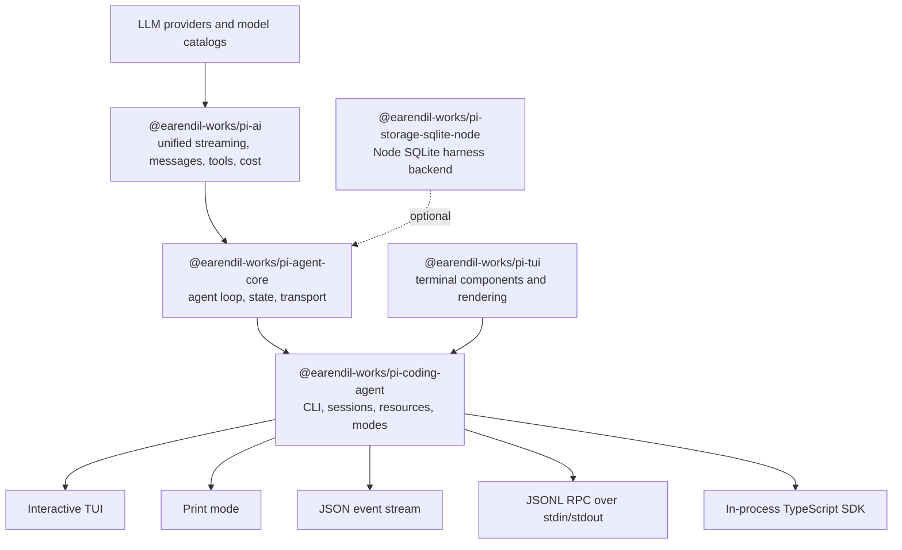
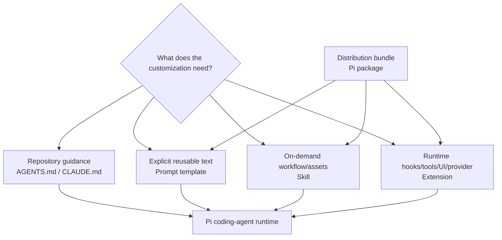
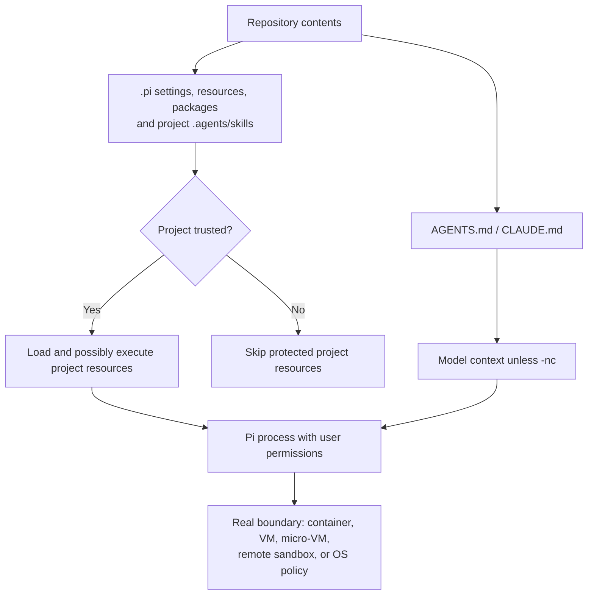

[English](./architecture.md) | [简体中文](./architecture.zh-CN.md)

# Pi architecture and customization decisions

<!-- sync:architecture-snapshot -->

This map separates the stable v0.83.0 release from post-release development.
Pi moves quickly: the researched `main` snapshot was 56 commits ahead of the
v0.83.0 tag only two days after the release commit. Use version-pinned source
links for implementation work and `latest` documentation for discovery.

<!-- sync:architecture-layers -->

## Packages and code present in the v0.83.0 source tree

| Layer | Use it when | Do not assume |
| --- | --- | --- |
| `pi-ai` | You need provider-normalized streaming, tool schemas, images, reasoning, usage, or cross-provider message conversion. | Provider abstractions are lossless; upstream documents several best-effort conversions. |
| `pi-agent-core` | You need an agent loop, state, attachments, event streaming, or a transport abstraction without the coding CLI. | It provides the coding-agent session UX or project resource discovery. |
| `pi-coding-agent` | You want the ready CLI, extensions, skills, prompts, packages, sessions, SDK, JSON mode, or RPC mode. | Its project trust prompt is a sandbox. |
| `pi-tui` | You are building terminal components or custom extension UI. | TUI behavior is identical in every terminal emulator. |
| `pi-storage-sqlite-node` | You embed the agent core and need the Node SQLite session store. | It replaces the coding agent's JSONL session semantics automatically. |
| `@earendil-works/pi-server` | You are researching the upstream experimental server. | Its CLI, API, or behavior is stable; its README explicitly says otherwise. |

The upstream root README's “All Packages” table lists four primary packages:
`pi-ai`, `pi-agent-core`, `pi-coding-agent`, and `pi-tui`. The v0.83.0 source
tree also contains the optional SQLite storage package, a private evaluation
workspace, and install artifacts. `@earendil-works/pi-server` is present but
explicitly experimental.

<!-- sync:architecture-main-only -->

## Main-only experimental protocol

The experimental server already existed in v0.83.0. At `main@9b50b046…`, the
repository also contains `@earendil-works/pi-protocol`, a transport-neutral
framed-CBOR protocol added after the v0.83.0 tag:

- protocol version 2 frames one definite-length CBOR item with a four-byte
  unsigned big-endian length;
- the first client message is `hello` with a protocol version and bearer token;
- snapshots are authoritative, while progress events are transient;
- the package declares no compatibility guarantee.

This is **not** the same interface as `pi --mode rpc`. The v0.83.0 released CLI
RPC uses newline-delimited JSON over stdin/stdout. A client written for one
cannot speak the other.

<!-- sync:architecture-resources -->

## Resource and instruction layers

These layers are complementary, not a power ranking:

| Need | Smallest suitable primitive | Reason |
| --- | --- | --- |
| Repository conventions and commands | `AGENTS.md` | Loaded as project context; easy to review in Git. |
| A reusable prompt with arguments | Prompt template | Expands on explicit slash-command use; no runtime code. |
| A specialized workflow with scripts or references | Skill | Progressive disclosure; full instructions load on demand. |
| Lifecycle interception, a tool, UI, provider, or policy | Extension | Runs TypeScript in-process and has event/API access. |
| Share multiple resources | Pi package | Bundles extensions, skills, prompts, and themes through npm, Git, or a local path. |
| Embed in a TypeScript application | SDK | Direct access to sessions, resources, tools, and events. |
| Integrate a non-Node process | v0.83.0 CLI RPC mode | Strict JSONL request, response, and event protocol over stdio. |
| Consume events without two-way control | JSON mode | Machine-readable event stream for one run. |

**Inference:** prefer the least powerful layer that meets the need. This reduces
ambient code execution, review surface, startup coupling, and upgrade risk.

<!-- sync:architecture-trust -->

## Trust and execution boundary

Project trust decides whether Pi may load project-local settings, packages,
skills, prompts, themes, system prompt files, and extensions. It does not limit
what built-in tools, the model, or already-loaded extensions can do.

Important edge cases:

- `AGENTS.md` and `CLAUDE.md` are context files and load regardless of a declined
  project trust decision unless context loading is disabled.
- user/global extensions and explicit CLI `-e` extensions load before project
  trust is resolved and can handle the trust event;
- non-interactive modes cannot display the trust prompt; without a saved
  decision, `ask` and `never` skip protected project resources, while `always`
  loads them;
- `--approve` and `--no-approve` override project trust for one run;
- extensions execute with the Pi process's user permissions;
- packages may install dependencies, and skills may instruct the model to run
  executables.

For untrusted or unattended work, the meaningful boundary is outside Pi:
container, VM, micro-VM, remote sandbox, or policy-controlled sandbox with
minimal files, credentials, and network access.

<!-- sync:architecture-sessions -->

## Sessions and context lifecycle

The coding agent stores sessions as JSONL trees. Entries have `id` and
`parentId`; the active leaf selects the current branch.

| Operation | Same file? | Best use |
| --- | --- | --- |
| `/tree` | Yes | Explore or return to alternatives while keeping one history tree. |
| `/fork` | No | Start a separate session from an earlier user prompt. |
| `/clone` | No | Duplicate the current active branch before continuing independently. |
| `/compact` | Yes | Replace older model-visible context with a lossy structured summary; original entries remain in the file. |

Automatic compaction triggers near the model context limit. By default v0.83.0
reserves 16,384 tokens for a response and keeps approximately 20,000 recent
tokens unsummarized. Compaction preserves the full JSONL history but not all
details in the model-visible summary. Durable decisions therefore belong in
version-controlled files, not only in chat.

<!-- sync:architecture-integration -->

## Integration modes

| Mode | Boundary | Input/output | Good fit | Primary caution |
| --- | --- | --- | --- | --- |
| Interactive | Human terminal | TUI | Daily supervised coding | Terminal compatibility and full local permissions. |
| Print (`-p`) | Process | Prompt/stdin → final output | Scripts and one-shot analysis | Use explicit tools and trust flags; no trust prompt. |
| JSON | Process | Prompt/stdin → JSON events | Logging and event consumers | Consumers must handle streaming and partial events. |
| Released CLI RPC | Long-lived child process | LF-delimited JSONL over stdio | Non-Node controllers and alternate UIs | Split only on `\n`; no long-term compatibility guarantee is documented, so pin the Pi version. |
| SDK | In-process TypeScript | Direct objects and event subscriptions | Deep embedding and custom runtimes | Your app owns lifecycle, cleanup, credentials, sessions, and resource policy. |
| Experimental CBOR protocol | Custom byte transport | Length-prefixed CBOR | Research into remote sessions on current `main` | Main-only, explicitly unstable, separate from CLI RPC. |

<!-- sync:architecture-decision -->

## Decision checklist

Before building a customization, answer in order:

1. Can a concise `AGENTS.md` instruction solve it?
2. Is it a repeatable explicit task that fits a prompt template?
3. Does it need on-demand references or helper scripts, making it a skill?
4. Does it need runtime events, tools, UI, policy, or a provider, making it an
   extension?
5. Does it need distribution, making the extension/skill a package?
6. Does another program own the user experience, making SDK or RPC more
   appropriate?
7. What is the actual security boundary, and can the customization bypass it?
8. Which Pi version and package versions will be tested and pinned?

See the [official source map](research/source-map.md) for version-pinned evidence.
