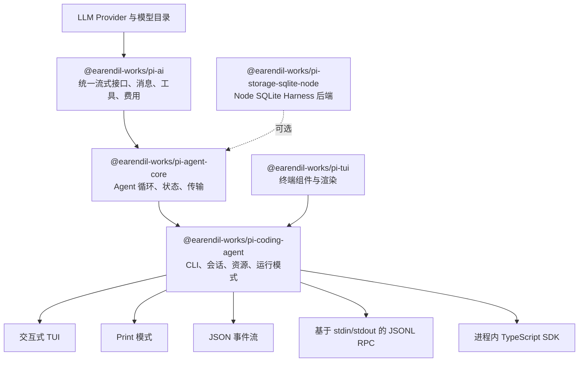
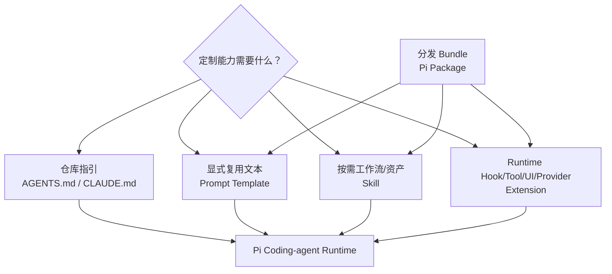
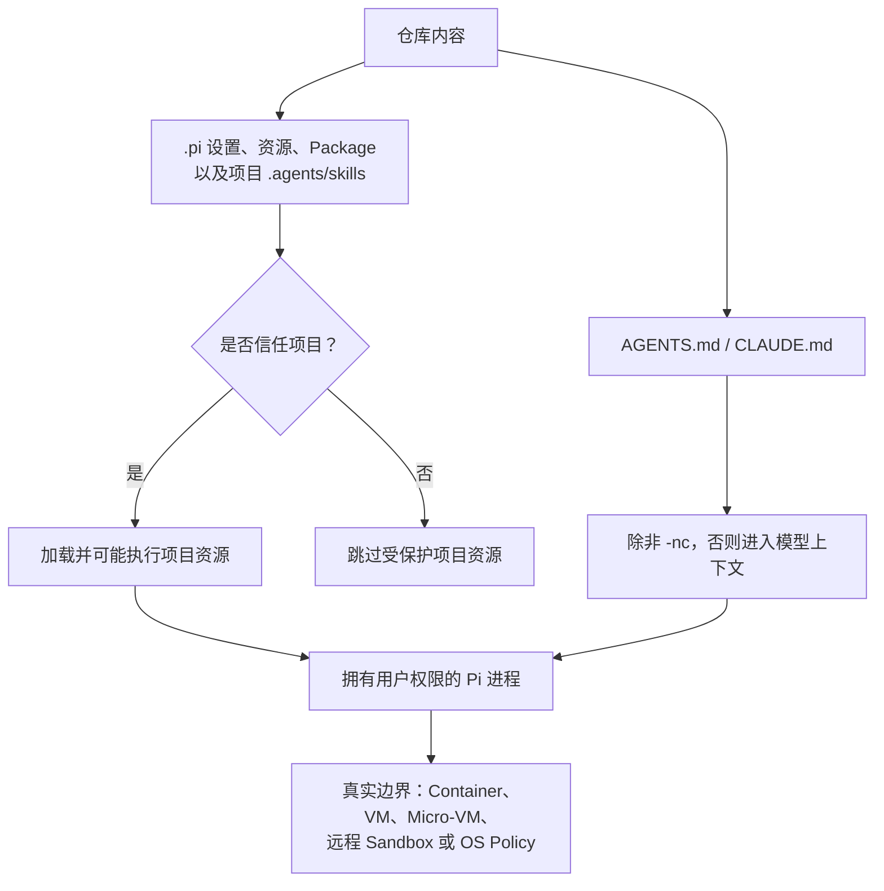

[English](./architecture.md) | [简体中文](./architecture.zh-CN.md)

# Pi 架构与定制决策

<!-- sync:architecture-snapshot -->

本图谱明确区分稳定版 v0.83.0 与发布后的开发内容。Pi 演进很快：研究所用的
`main` 快照在 v0.83.0 release commit 发布仅两天后就已经领先 56 个 commit。
实现工作应使用固定版本的源码链接，发现新能力时再参考 `latest` 文档。

<!-- sync:architecture-layers -->

## v0.83.0 源码树中存在的 Package 与代码

| 层 | 适用场景 | 不应假设 |
| --- | --- | --- |
| `pi-ai` | 需要统一 Provider 的流式响应、工具 Schema、图像、推理、用量或跨 Provider 消息转换。 | Provider 抽象是无损的；上游明确把多种转换称为尽力而为。 |
| `pi-agent-core` | 需要 Agent 循环、状态、附件、事件流或传输抽象，但不需要编程 CLI。 | 它自带 coding-agent 的会话 UX 或项目资源发现。 |
| `pi-coding-agent` | 需要现成 CLI、Extension、Skill、Prompt、Package、会话、SDK、JSON 或 RPC 模式。 | Project Trust 提示就是 Sandbox。 |
| `pi-tui` | 构建终端组件或 Extension 自定义 UI。 | 所有终端模拟器中的行为完全一致。 |
| `pi-storage-sqlite-node` | 嵌入 Agent Core，并需要 Node SQLite 会话存储。 | 它会自动替代 coding agent 的 JSONL 会话语义。 |
| `@earendil-works/pi-server` | 研究上游实验性 Server。 | 它的 CLI、API 或行为稳定；README 明确否认这一点。 |

上游根 README 的 “All Packages” 表列出四个主要 Package：`pi-ai`、
`pi-agent-core`、`pi-coding-agent` 和 `pi-tui`。v0.83.0 源码树还包含可选的
SQLite Storage Package、私有评测 Workspace 与安装工件；
`@earendil-works/pi-server` 已经存在，但被明确标为实验性。

<!-- sync:architecture-main-only -->

## 仅 main 存在的实验协议

实验性 Server 在 v0.83.0 中已经存在。在 `main@9b50b046…` 中，仓库还包含
`@earendil-works/pi-protocol`（与传输无关的分帧 CBOR 协议）；该 Package 在
v0.83.0 Tag 之后加入：

- 协议版本 2 使用四字节无符号大端长度，加一个 definite-length CBOR item；
- 第一条客户端消息必须是 `hello`，携带协议版本与 bearer token；
- Snapshot 是权威状态，Progress Event 只是临时 UI 提示；
- Package 明确不提供兼容性保证。

它**不是** `pi --mode rpc`。v0.83.0 已发布的 CLI RPC 使用 stdin/stdout 上以
换行分隔的 JSON。为其中一个接口编写的客户端不能与另一个直接通信。

<!-- sync:architecture-resources -->

## 资源与指令层

这些层相互补充，不是“能力越强越好”的排行：

| 需求 | 满足需求的最小原语 | 原因 |
| --- | --- | --- |
| 仓库约定与命令 | `AGENTS.md` | 作为项目上下文加载，便于在 Git 中审查。 |
| 带参数的可复用提示词 | Prompt Template | 通过显式 Slash Command 展开，无运行时代码。 |
| 带脚本或参考资料的专业工作流 | Skill | 渐进披露，只在需要时加载完整说明。 |
| 生命周期拦截、工具、UI、Provider 或策略 | Extension | 在进程内运行 TypeScript，可访问 Event/API。 |
| 分享多类资源 | Pi Package | 通过 npm、Git 或本地路径捆绑 Extension、Skill、Prompt 和 Theme。 |
| 嵌入 TypeScript 应用 | SDK | 直接访问会话、资源、工具和事件。 |
| 与非 Node 进程集成 | v0.83.0 CLI RPC 模式 | 基于 stdio 的严格 JSONL 请求、响应和事件协议。 |
| 只消费单次执行事件 | JSON 模式 | 机器可读事件流。 |

**推论：**优先选择能满足需求的最小能力层。这样可以减少环境代码执行、审查面、
启动耦合和升级风险。

<!-- sync:architecture-trust -->

## 信任与执行边界

Project Trust 只决定 Pi 是否加载项目级设置、Package、Skill、Prompt、Theme、
System Prompt 文件和 Extension。它不会限制内建工具、模型或已加载 Extension
能做什么。

必须注意的边界情况：

- `AGENTS.md` 与 `CLAUDE.md` 是上下文文件；即使拒绝 Project Trust，它们仍会
  加载，除非显式关闭上下文加载；
- 用户/全局 Extension 和 CLI 显式 `-e` Extension 会在 Project Trust 决策前
  加载，并可处理 trust event；
- 非交互模式不能显示信任提示；无已保存决定时，`ask` 和 `never` 跳过受保护项目
  资源，`always` 则加载；
- `--approve` 与 `--no-approve` 可以覆盖单次运行的项目信任；
- Extension 以 Pi 进程所属用户的权限执行；
- Package 可能安装依赖，Skill 可能指示模型执行程序。

处理不可信或无人值守任务时，有效边界必须在 Pi 之外：Container、VM、
Micro-VM、远程 Sandbox 或 Policy-controlled Sandbox，并只提供最少文件、
凭据和网络访问。

<!-- sync:architecture-sessions -->

## 会话与上下文生命周期

Coding Agent 把会话保存为 JSONL 树。每个 Entry 有 `id` 和 `parentId`；当前
Active Leaf 决定所用分支。

| 操作 | 是否同一文件 | 最适合 |
| --- | --- | --- |
| `/tree` | 是 | 在保留一棵历史树的前提下探索或返回不同方案。 |
| `/fork` | 否 | 从更早的用户 Prompt 新建独立会话。 |
| `/clone` | 否 | 复制当前 Active Branch，再独立继续。 |
| `/compact` | 是 | 用有损结构化摘要替换较早的模型可见上下文；原始 Entry 仍在文件中。 |

自动 Compaction 在接近模型上下文上限时触发。v0.83.0 默认预留 16,384 token
用于响应，并保留约 20,000 个近期 token 不做摘要。Compaction 保留完整 JSONL
历史，但不会在模型可见摘要中保留所有细节。因此，长期有效的决定应写入版本控制
文件，而不能只留在聊天里。

<!-- sync:architecture-integration -->

## 集成模式

| 模式 | 边界 | 输入/输出 | 合适场景 | 主要注意事项 |
| --- | --- | --- | --- | --- |
| Interactive | 人类终端 | TUI | 日常有人监督的编程 | 终端兼容性与完整本地权限。 |
| Print（`-p`） | 进程 | Prompt/stdin → 最终输出 | 脚本和一次性分析 | 显式限制工具和 Trust Flag；不会出现信任提示。 |
| JSON | 进程 | Prompt/stdin → JSON Event | 日志与事件消费方 | 必须处理流式与部分事件。 |
| 已发布 CLI RPC | 长生命周期子进程 | stdio 上 LF 分隔 JSONL | 非 Node 控制器与替代 UI | 只能按 `\n` 分割；上游未承诺长期兼容，因此固定 Pi 版本。 |
| SDK | 进程内 TypeScript | 直接对象与事件订阅 | 深度嵌入与自定义 Runtime | 应用自己承担生命周期、清理、凭据、会话和资源策略。 |
| 实验 CBOR 协议 | 自定义字节传输 | 长度前缀 CBOR | 研究当前 `main` 的远程会话 | 仅 main、明确不稳定、与 CLI RPC 分离。 |

<!-- sync:architecture-decision -->

## 决策检查表

构建定制能力之前，按顺序回答：

1. 一条简洁的 `AGENTS.md` 指令能否解决？
2. 它是否是适合 Prompt Template 的重复、显式任务？
3. 它是否需要按需参考资料或辅助脚本，从而适合 Skill？
4. 它是否需要运行时 Event、Tool、UI、Policy 或 Provider，从而必须用 Extension？
5. 它是否需要分发，从而应把 Extension/Skill 做成 Package？
6. 是否由另一个程序拥有 UX，从而 SDK 或 RPC 更合适？
7. 真正的安全边界在哪里，定制能力能否绕过它？
8. 将测试和固定哪个 Pi 版本及 Package 版本？

版本固定的证据见[官方来源地图](research/source-map.zh-CN.md)。
