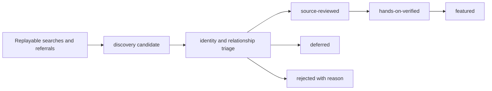

[English](./discovery-protocol.md) | [简体中文](./discovery-protocol.zh-CN.md)

# Ecosystem discovery protocol

<!-- sync:discovery-purpose -->

This protocol defines a high-recall, auditable discovery layer for Pi ecosystem
research. It records leads before the slower source-review and hands-on stages,
so a project cannot disappear merely because it was not ready for promotion.
The protocol complements the [research methodology](methodology.md); it does not
weaken that methodology's evidence, licensing, safety, or human-verification
requirements.

The discovery layer has four goals:

1. Preserve what was searched, what was returned, and what happened to every
   result.
2. Represent direct, indirect, historical, and derived relationships to Pi.
3. Make omissions and under-sampled areas visible without treating a large
   catalog as a recommendation list.
4. Keep discovery inexpensive while keeping promotion deliberately strict.

## Discovery is not promotion

<!-- sync:discovery-boundary -->

Discovery and promotion are separate pipelines:

A discovery candidate is an untrusted lead, not a quality claim. Presence in a
catalog, directory, query result, candidate registry, or coverage cell is **not
endorsement**. Stars, downloads, ranking, generated descriptions, and catalog
presence remain discovery signals only. They must not be used as promotion
evidence.

The existing `source-reviewed`, `hands-on-verified`, and `featured` gates remain
strict:

- `source-reviewed` still requires review of purpose, code, license,
  maintenance, dependencies, authority, and obvious risks at an immutable
  version;
- `hands-on-verified` still requires a named human, exact environment, commands,
  expected and actual results, negative cases, cleanup, and a retest trigger;
- `featured` still requires hands-on evidence plus maintainer judgment about
  usefulness, documentation, maintenance, licensing, and residual risk.

Discovery automation must never promote a candidate, rewrite curated resources,
open issues or pull requests, install candidate software, or execute candidate
code.

## Candidate record

<!-- sync:discovery-record -->

Each lead receives one stable `id` in the checked-in candidate registry.
A record must preserve enough context for another reviewer to reconstruct the
lead without trusting the original researcher. At minimum, record:

| Field | Requirement |
| --- | --- |
| Canonical identity | Stable `id`, display `name`, and canonical public URL. |
| Aliases and packages | Previous names, moved URLs, repository names, and structured package identities published by the candidate itself. Pi packages consumed by the candidate belong in versioned relationship evidence, not this collision-checked identity list. Empty lists are explicit. |
| Discovery provenance | `firstSeenAt`, `lastUpdatedAt`, and one or more structured query-run, catalog, issue, pull-request, referral, or source records. |
| Snapshot | An immutable commit, tag, package version, or dated metadata snapshot in `snapshotRef`. If temporarily unavailable, use `null` plus a precise `snapshotRefReason`; discovery-source `ref` uses the same `null` + `refReason` contract. |
| Pi relationship | One or more relation types, minimal public evidence, and whether the relationship is current, historical, direct, indirect, or still uncertain. |
| Coverage placement | One primary practice category, optional secondary categories, and one or more `architectureTypes`. |
| License | Declared, not detected, ambiguous, or needing verification, plus the license identifier when declared. |
| Decision | Current disposition, its `dispositionReasonCode`, a factual `dispositionReason`, `reviewStatus`, and the constant `endorsementStatus: not-evaluated`. |
| Promotion link | `resourceId` when and only when the candidate has been promoted into the curated resource registry. |

The lightweight issue intake may omit a ref, and the machine-readable discovery
registry may retain a lead whose exact snapshot is temporarily unavailable.
Such a record uses `null` and a precise reason; it must never use a mutable
branch name or invented placeholder as if it were immutable. This preserves a
low-cost discovery entrance. Before source-reviewed status or promotion, the
reviewer must resolve the canonical identity and pin the exact artifact being
assessed.

A non-null ref may be an immutable commit, tag, package version, or dated
snapshot. Mutable aliases such as `main`, `master`, `latest`, and `HEAD` are
forbidden. A value that has commit syntax must be the full 40-character
lowercase SHA.

Other unknown values must be represented explicitly rather than guessed. A
candidate may be registered before its license or maintenance state has been
verified. Those unknowns block promotion when material; they do not justify
discarding the lead.

Candidate records are the normalized view. Raw query logs are preserved in the
[discovery-run ledger](../../data/discovery-runs.json) and remain the audit
trail; they must not be rewritten merely because a project was renamed, moved,
rejected, or promoted. A historical import whose original query and pre-filter
denominator were not preserved must use
`replayability: reconstructed-non-replayable`, claim no complete batch, and
state its truncation boundary. It links known leads; it is not a substitute for
a raw query log.

## Replayable query log

<!-- sync:discovery-query-log -->

Every bounded discovery run must have a stable `id`. A replayable log records:

- the exact query string or API request parameters, without credentials;
- execution time in ISO 8601 with an explicit timezone (UTC preferred);
- platform, endpoint, and client/tool version when relevant;
- `status`, request-attempt count, nullable rate-limit metadata, and a sanitized
  structured error for partial or failed runs;
- sort order and direction;
- page numbers, result offsets, or opaque pagination cursors that contain no
  secret;
- result limit, pages attempted, pages completed, and known truncation or API
  limits;
- every raw public result identifier in returned order before filtering;
- the raw public `sourceUrl` captured at the time of the run and, when mapped,
  a separate `resolvedCandidateUrl` that must match the candidate's canonical
  identity;
- aliases, redirects, package-to-repository mappings, and monorepo subpaths
  discovered during normalization;
- the candidate `id` assigned to each result, or a disposition and reason code
  explaining why it did not become a distinct candidate;
- the immutable ref or metadata snapshot used for later claims, or `null` with
  the precise reason it is not yet available;
- errors, retries, access limitations, and any manual steps.

A completed zero-hit run is evidence about that exact query and time, so its
`rawResults` array is intentionally allowed to be empty. Do not omit it. A
failed or partial run likewise remains in the ledger with no fabricated result
URL; the run-level error record carries the failure.

Do not silently drop duplicates, archived repositories, missing-license
projects, irrelevant results, or failed lookups. Preserve their raw IDs and map
them to a documented outcome. If a provider prevents full enumeration, record
the boundary precisely; do not describe the result as ecosystem-complete.

The query text, sort, time, and page/cursor are a unit. Changing any of them
creates a new run rather than modifying history. Logs may be corrected through
a reviewable commit, but the correction must retain the original observation
and explain the change.

## Pi relationship types

<!-- sync:discovery-relations -->

Assign every candidate one or more of these relationship types. The type
describes evidence of ecosystem connection, not quality or compatibility.

| Code | Relationship | Meaning and typical evidence |
| --- | --- | --- |
| `pi-package-or-resource` | Pi package or resource | A package, extension, skill, prompt, theme, template, or tool intended for Pi; verify through a manifest, package metadata, Pi installation instructions, or Pi-specific source. |
| `sdk-embedder` | SDK embedder | Embeds Pi libraries in-process; verify imports, dependency manifests, and construction of Pi sessions or agents. |
| `rpc-json-consumer` | RPC or JSON consumer | Controls or bridges Pi through RPC or JSON mode; verify the spawn command, client implementation, or integration test. |
| `acp-consumer` | ACP consumer | Controls or bridges Pi through ACP; verify the protocol adapter, client configuration, or integration test. |
| `frontend-or-controller` | Frontend or controller | Provides an editor, web, mobile, messaging, remote-control, or other user-facing controller for Pi; verify the UI source and Pi control path. |
| `fork-or-alternate-distribution` | Fork or alternate distribution | Forks, repackages, rebrands, or distributes a Pi-based runtime; verify fork history, shared source ancestry, package provenance, or release metadata. |
| `derived-or-internalized-from-pi` | Derived or internalized | Adapts Pi code or replaces a former Pi dependency with a project-owned derivative; verify provenance notices, migration changes, copied/adapted source, or a maintainer statement confirmed by code. |
| `service-or-infrastructure` | Service or infrastructure | Supplies a service, gateway, memory, tracing, sandbox, evaluation, or operational integration specifically usable from Pi; verify the Pi adapter/package and invoked service boundary. |
| `official-adjacent` | Official-adjacent | An upstream-owned example, tutorial, review tool, RFC implementation, or related artifact outside the primary release surface; verify official organization ownership and Pi-specific scope. |
| `historical-or-archived` | Historical or archived | An archived, renamed, superseded, or formerly Pi-connected artifact useful for ecosystem history; verify immutable historical dependencies, archived source, redirects, or release history. |
| `historical-sdk-embedder` | Historical SDK embedder | Embedded Pi libraries at an earlier pinned ref but does not claim that architecture at the current snapshot; preserve both historical and current evidence. |
| `pi-package-consumer` | Pi package consumer | Currently consumes a Pi package without necessarily embedding the core SDK; verify the pinned manifest, import/use site, and package role. |
| `indirect-consumer` | Indirect consumer | Reaches Pi through another bridge, adapter, or product rather than a direct Pi interface; preserve the intermediate dependency path. |

A project can hold several relationships simultaneously and relationships can
change over time. Record time scope and evidence rather than overwriting a
historical direct relationship with a current indirect one. Do not infer a
relationship from a similar name alone.

## Dispositions and reason codes

<!-- sync:discovery-dispositions -->

Disposition records workflow state; reason codes explain the decision. Use one
current disposition and preserve prior decisions in version history or an
append-only decision log.

| Disposition | Use |
| --- | --- |
| `awaiting-source-review` | Pi relationship is credible enough for a pinned source review. |
| `source-review-in-progress` | A reviewer is checking the pinned source and promotion gates. |
| `deferred` | Worth retaining, but a named prerequisite or capacity constraint prevents current review. |
| `rejected` | Not eligible for promotion under the current scope; a factual reason is required. |
| `promoted-to-resource` | Added to the curated resource registry after source review; `resourceId` is required. |

Use the narrowest applicable reason code. The allowed codes are:

| Reason code | Meaning |
| --- | --- |
| `source-review-not-started` | A credible candidate is queued and no source review has begun. |
| `source-review-underway` | Pinned source review is active. |
| `capacity-or-priority` | Review is deferred because of capacity or documented sampling priority. |
| `license-needs-resolution` | License or reuse boundary must be resolved before promotion. |
| `scope-needs-resolution` | Category, architecture, or Pi relevance needs a scope decision. |
| `insufficient-relation-evidence` | Pi connection is plausible but not yet supported by sufficient public evidence. |
| `duplicate-candidate` | The result is another identity of an existing candidate. |
| `out-of-scope` | No material Pi-shaped practice or ecosystem relationship fits the documented scope. |
| `promoted-after-source-review` | Source review passed and promotion is linked to a curated resource. |

Allowed disposition/reason pairings are deliberately narrow:

- `awaiting-source-review`: `source-review-not-started`,
  `capacity-or-priority`, `license-needs-resolution`,
  `scope-needs-resolution`, or `insufficient-relation-evidence`;
- `source-review-in-progress`: `source-review-underway`;
- `deferred`: `capacity-or-priority`, `license-needs-resolution`,
  `scope-needs-resolution`, or `insufficient-relation-evidence`;
- `rejected`: `insufficient-relation-evidence`, `duplicate-candidate`, or
  `out-of-scope`;
- `promoted-to-resource`: `promoted-after-source-review`.

Rejection is not a public shame label. Notes must be neutral, evidence-based,
version-scoped, and limited to eligibility. Popularity, author identity, or a
failure to reply is not by itself a rejection reason.

## Search families

<!-- sync:discovery-search -->

A discovery cycle uses several independent search families. No single catalog
or name query is an ecosystem sampling frame.

1. **Directories and catalogs:** enumerate official catalogs, awesome lists,
   wikis, package indexes, and curated directories while retaining every raw
   identifier and the pinned directory ref.
2. **Repository metadata:** search names, topics, descriptions, READMEs, issues,
   and pull requests using current and historical project/package names.
3. **Reverse dependencies:** query package registries and dependency graphs for
   current and historical Pi package scopes and exact package identities.
4. **Code signatures:** search manifests, lockfiles, imports, session builders,
   CLI invocations, extension APIs, and other version-specific Pi symbols.
5. **Protocol consumers:** search for Pi RPC/JSON commands, ACP bridges, process
   spawning, session streams, and client/server adapters.
6. **Provenance:** inspect fork ancestry, redirects, release history,
   `THIRD_PARTY_NOTICES`, and phrases such as “forked from,” “adapted from,”
   “based on,” or “derived from.”
7. **Product surfaces:** search editor, web, mobile, messaging, remote-control,
   CI/review, model gateway, local runtime, memory, tracing, sandbox, evaluation,
   export, and publishing terms even when the product name omits Pi.
8. **Official adjacency and history:** enumerate upstream organization
   repositories, examples, tutorials, RFC artifacts, renamed projects, archived
   projects, and former package scopes.
9. **Referrals:** accept community and maintainer leads through the lightweight
   candidate issue form, then verify the public relationship independently.

Checked-in `discoverySources[].kind` values are limited to
`ecosystem-directory`, `repository-search`, `code-search`,
`reverse-dependency`, `package-registry`, `primary-source`,
`provenance-notice`, and `manual-gap-audit`. Before check-in, a referral is
mapped to a public source represented by one of those kinds; if it cannot yet be
pinned, its `ref` is `null` and `refReason` records why.

Search both canonical and historical identities. A reverse-dependency result is
a lead, not proof that the dependency is reachable at runtime or compatible with
the research baseline.

## Identity, deduplication, and time

<!-- sync:discovery-identity -->

Normalize identity without erasing provenance:

- follow repository redirects and record both old and canonical URLs;
- map package names to repository and monorepo subpaths;
- retain previous project names and organization transfers as aliases;
- distinguish a duplicate listing from a materially independent fork;
- keep indirect consumers separate from the adapter they use;
- record relationship intervals or evidence dates when a dependency was added,
  removed, replaced, or internalized;
- pin evidence to a full commit, tag, package version, or dated metadata
  snapshot before source-review claims are made.

Exact URL equality is insufficient for deduplication. Conversely, shared source
ancestry is insufficient for collapsing an independently maintained fork. When
uncertain, keep the lead and record `insufficient-relation-evidence`; do not
guess or silently merge records.

## Stratified sampling and coverage

<!-- sync:discovery-sampling -->

The candidate registry aims for high recall, but source review is capacity
limited. Select review batches using both practice category and architecture,
not popularity or arrival order.

Practice categories come from the maintained coverage taxonomy. The separate
`architectureTypes` dimension uses these strata:

| Code | Architecture stratum |
| --- | --- |
| `resource-only` | A non-executing or declarative resource such as a prompt, theme, template, or individual skill. |
| `in-process-extension` | Pi loads and runs the integration in-process. |
| `sdk-embedder` | Another application embeds Pi libraries. |
| `rpc-json-consumer` | A client or controller uses Pi's RPC or JSON surface. |
| `acp-consumer` | A client or bridge uses ACP. |
| `frontend-controller` | An editor, web, mobile, messaging, or remote control surface. |
| `external-service` | A hosted service or local infrastructure integration. |
| `os-virtualization-boundary` | An operating-system, container, sandbox, or virtualization boundary. |
| `fork-alternate-distribution` | A fork, rebrand, repackaging, or alternate distribution. |
| `derived-internalized-runtime` | A runtime derived from or internalized from Pi. |
| `package-suite` | A coordinated set of packages or resources. |

For every category × architecture cell, report candidate count, source-reviewed
count, hands-on count, and unresolved/rejected count separately. Prioritize
cells with no reviewed representative, high authority or credential risk,
substantial user impact, or only one architecture represented. A single project
does not establish category completeness, and one project may occupy several
cells without being counted as several independent implementations.

Keep non-sampled candidates and their dispositions in the registry. Sampling
controls review order; it must not erase the denominator. Add platform,
provider, maintenance, license, and direct/indirect relationship as secondary
strata when they materially affect a decision.

## Privacy and security

<!-- sync:discovery-safety -->

Discovery operates on public, sanitized metadata. Never check in credentials,
authorization headers, private repository identifiers, private issue or source
content, personal contact data, signed URLs, browser profiles, session content,
unredacted logs, or unpublished vulnerability details. Do not preserve an opaque
cursor if the provider documents that it contains a secret; record a safe page
boundary instead.

Treat every candidate repository, package, workflow, badge, and generated file
as untrusted. Discovery does not authorize installation, lifecycle scripts,
builds, containers, binaries, extensions, browser automation, network callbacks,
or execution of candidate code. Inspect manifests and source statically at a
pinned ref before proposing a contained hands-on review.

Do not paste live exploit details into a candidate issue. Use the relevant
project's private security channel for a genuine vulnerability, and record only
a sanitized eligibility note here. Contributors disclose ownership,
employment, sponsorship, consulting, or other material relationships. Decision
notes must minimize personal data and avoid speculation about maintainers.

## Scheduled audit and bounded probe

<!-- sync:discovery-audit -->

The `Discovery audit and bounded probe` workflow runs weekly and on manual
dispatch. It uses read-only repository permissions and installs this
repository's pinned tooling with `npm ci --ignore-scripts`. It then performs two
separate operations:

1. `npm run check:discovery` validates checked-in schemas, stable identities,
   disposition contracts, promotion links, query configuration, URL safety,
   and cross-file consistency. `npm run check:coverage` additionally validates
   every relation/category/architecture assignment against the machine
   taxonomy, bilingual matrix identities, and generated coverage state.
2. `scripts/discovery-probe.mjs` executes the versioned queries in
   `data/discovery-queries.json` against GitHub's public Search API. Each query is
   restricted to its first page and at most 50 results. The workflow preserves
   normalized identifiers, repository URLs, evidence URLs, result positions,
   total counts, truncation signals, and rate-limit metadata in a JSON artifact
   for 14 days; it does not copy source snippets. Each response must explicitly
   identify a public repository (`private: false` or `visibility: public`). The
   probe fails closed if it sees any non-public or ambiguous-visibility result:
   it drops every identity, total, truncation value, and exact redaction count
   for that query, preserving only a contamination flag. A failed query records
   only sanitized status/error metadata, does not erase
   earlier successful results, and makes the probe step fail after the partial
   artifact is written and uploaded. Code-search queries may not use repository
   visibility qualifiers because the legacy Search API can return a misleading
   zero-result response for them. The report also fails a scope/semantics health
   check when every configured code-search family completes with zero results,
   even if every HTTP request succeeded.

The live probe is a lead generator, not a registry writer. It does not query
package registries, follow redirects, assess current compatibility, install or
execute candidate code, modify repository files, open issues, create branches,
or promote candidates. A human must triage the artifact, pin primary evidence,
and submit any accepted raw result, run record, candidate, or decision through
normal review.
Its uploaded JSON is a **pre-triage signal artifact**, not automatically a
conforming `data/discovery-runs.json` entry. Import requires a human to preserve
the execution context, normalize source versus candidate URLs, assign every
result disposition, and retain zero-hit or failed queries.

Use this explicit artifact-to-ledger mapping when a reviewed artifact is
imported. One artifact query becomes one ledger run; the multi-query report is
never collapsed into a single run.

| Probe artifact | Reviewed run-ledger mapping |
| --- | --- |
| `executedAt` + `queries[].id` | Stable slug such as `github-2026-08-01-<query-id>`; add a documented suffix rather than overwriting a collision. |
| Query `endpoint` | `sourceKind: code-search` or `repository-search`; use platform `GitHub`. |
| `request.url` and `query` | Strip the query string from `request.url` into ledger `endpoint`; preserve the exact search expression separately in `query`. |
| Probe/API versions and `requestAttempts` | Build the ledger `client` string from the probe, Node, and GitHub API versions; copy the per-query attempt count. |
| `request.sort`, `request.order`, `request.page`, and `request.perPage` | Map to ledger sort and first-page pagination. A returned first page is one completed page; a failed/redacted page is zero. |
| `paginationTruncated`, `apiIncomplete`, and failures | Preserve `truncated: true` and a precise reason whenever more indexed results exist, the API is incomplete, visibility is redacted, or the request failed; then `completeForClaimedBatch` is false. |
| Query `status` and `error` | A clean, non-truncated response may be `completed`; API-incomplete becomes `partial`; a query failure becomes `failed`. Map `error.status` to ledger `error.httpStatus`, otherwise use `null`, and retain the sanitized message. |
| `rawResults` | Preserve returned order and public `evidenceUrl` as `sourceUrl`; a reviewer must resolve canonical candidate URLs and assign every disposition/reason before commit. |
| Report `healthFailures` | An all-zero code-search health failure blocks a completed import. Resolve token/query scope and rerun, or preserve the affected code runs as failed with that limitation. |

The local `discovery-artifacts/` directory is ignored by Git. Treat it as
ephemeral pre-triage data: retain a needed report through the 14-day workflow
artifact or an explicitly reviewed ledger import, and remove local copies under
the repository's normal data-retention policy.

A successful scheduled run therefore means “the committed records and query
configuration are internally valid, this bounded set of GitHub searches
completed, and the all-zero code-search regression guard did not fire.” It does
not mean the ecosystem is complete or current. Ranking,
index coverage, vocabulary, pagination, API limits, renamed packages, private
repositories, non-GitHub hosts, and registry-only integrations remain explicit
blind spots. The default Actions token is repository-scoped and may restrict
cross-repository code-search visibility. Maintainers must inspect the artifact
for external repository hits after workflow changes; an optional least-privilege
`DISCOVERY_SEARCH_TOKEN` secret may widen public search access without granting
write or private-repository permissions. Token scope is recorded as context,
never as a credential.

## Promotion checklist

<!-- sync:discovery-promotion -->

Before changing a candidate to `promoted-to-resource`:

1. Resolve canonical identity, aliases, relation type, time scope, and immutable
   ref.
2. Replace catalog or search assertions with source, manifest, test, registry,
   or primary documentation evidence.
3. Review purpose, license, maintenance, dependencies, install/lifecycle
   behavior, execution authority, credentials, data flow, persistence, and
   cleanup.
4. Assign practice category and architecture based on observed behavior.
5. Record conflicts of interest and AI assistance.
6. Add the curated resource with the appropriate evidence status and link its
   `resourceId` from the candidate.
7. Keep `source-reviewed`, `hands-on-verified`, and `featured` distinct; never
   infer a higher state from catalog presence or a passing discovery audit.
8. Update fact-equivalent English and Simplified Chinese documentation and run
   all repository checks.

Promotion improves the curated collection; it does not delete the discovery
history that explains how the project was found and assessed.
