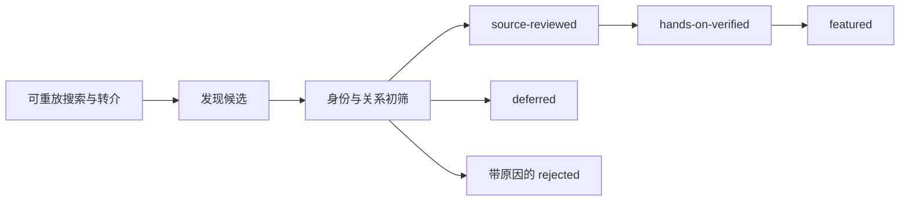

[English](./discovery-protocol.md) | [简体中文](./discovery-protocol.zh-CN.md)

# 生态发现协议

<!-- sync:discovery-purpose -->

本协议为 Pi 生态研究定义一个高召回、可审计的发现层。它在较慢的源码审查和亲测阶段
之前保存线索，避免一个项目仅仅因为尚未达到晋级条件就从流程中消失。本协议补充
[研究方法论](methodology.zh-CN.md)，不会降低其中对证据、License、安全或人类核验
的要求。

发现层有四个目标：

1. 保存搜索了什么、返回了什么，以及每条结果最终如何处理。
2. 表达项目与 Pi 的直接、间接、历史和派生关系。
3. 让遗漏和欠采样区域可见，同时避免把大型目录误当成推荐列表。
4. 保持发现成本低，同时有意维持严格的晋级门槛。

## 发现不等于晋级

<!-- sync:discovery-boundary -->

发现与晋级是两条分离的流水线：

发现候选是不受信任的线索，不是质量声明。出现在 Catalog、Directory、查询结果、
候选注册表或覆盖单元格中均**不代表背书**。Stars、下载量、排名、生成式描述和
目录收录仍然只能作为发现信号，绝不能作为晋级证据。

现有的 `source-reviewed`、`hands-on-verified` 和 `featured` 门槛保持严格：

- `source-reviewed` 仍要求在不可变版本上审查用途、代码、License、维护、依赖、
  权限与明显风险；
- `hands-on-verified` 仍要求记录具名人类、精确环境、命令、预期与实际结果、
  负向案例、清理和重测触发条件；
- `featured` 仍要求亲测证据，以及维护者对实用性、文档、维护、License 和残余
  风险的判断。

发现自动化绝不能晋级候选、重写已策展资源、创建 Issue 或 PR、安装候选软件，
也不能执行候选代码。

## 候选记录

<!-- sync:discovery-record -->

每条线索在已提交的候选注册表中获得一个稳定 `id`。记录必须保留足够上下文，
使其他审查者无需相信最初研究者也能重建该线索。至少记录：

| 字段 | 要求 |
| --- | --- |
| 规范身份 | 稳定 `id`、显示 `name` 和规范公开 URL。 |
| 别名与 Package | 旧名称、迁移前 URL、仓库名，以及候选自身发布的结构化 Package Identity。候选所消费的 Pi Package 应写入带版本的关系证据，不能放进这个用于冲突检测的身份列表；空列表也要显式记录。 |
| 发现来源 | `firstSeenAt`、`lastUpdatedAt`，以及一个或多个结构化查询运行、Catalog、Issue、PR、转介或源码记录。 |
| 快照 | `snapshotRef` 使用不可变 Commit、Tag、Package Version 或带日期的 Metadata Snapshot；暂时不可得时使用 `null` 和精确 `snapshotRefReason`。发现来源的 `ref` 同样使用 `null` + `refReason` 契约。 |
| Pi 关系 | 一个或多个关系类型、最低限度的公开证据，以及关系属于当前、历史、直接、间接还是仍不确定。 |
| 覆盖位置 | 一个主要实践类别、可选次要类别，以及一个或多个 `architectureTypes`。 |
| License | Declared、Not Detected、Ambiguous 或 Needs Verification；已声明时还要记录 License 标识。 |
| 决定 | 当前处置、对应的 `dispositionReasonCode`、事实性的 `dispositionReason`、`reviewStatus`，以及恒为 `not-evaluated` 的 `endorsementStatus`。 |
| 晋级链接 | 当且仅当候选已晋级策展资源注册表时填写 `resourceId`。 |

轻量 Issue Intake 可以不提供 Ref；机器可读发现注册表也可以保留暂时没有精确快照的
线索。此类记录使用 `null` 和精确原因，绝不能用可变分支名或虚构占位符冒充不可变
Ref。这保留了低成本发现入口。达到 source-reviewed 或晋级前，审查者必须解析规范
身份，并固定被评估的精确制品。

非空 Ref 可以是不可变 Commit、Tag、Package Version 或带日期的 Snapshot。
`main`、`master`、`latest` 和 `HEAD` 等可变别名均被禁止；呈 Commit 形态的值必须是
完整的 40 位小写 SHA。

其他未知值必须明确表示，不能猜测。候选的 License 或维护状态尚未核实时也可以登记。
这些未知项在具有实质影响时会阻止晋级，但不构成丢弃线索的理由。

候选记录是规范化视图。Raw Query Log 保存在
[发现运行 Ledger](../../data/discovery-runs.json)中并继续作为审计轨迹，不能仅仅因为
项目改名、迁移、被拒绝或晋级就重写它。若历史导入没有保留原始 Query 与过滤前分母，
必须使用 `replayability: reconstructed-non-replayable`，不得声称 Batch 完整，并明确
Truncation Boundary。它只能链接已知线索，不能冒充 Raw Query Log。

## 可重放查询日志

<!-- sync:discovery-query-log -->

每次有界发现运行都必须有稳定 `id`。可重放日志记录：

- 精确查询字符串或 API 请求参数，但不包含凭据；
- 带明确时区的 ISO 8601 执行时间（优先 UTC）；
- 相关时的平台、Endpoint 与客户端/工具版本；
- `status`、Request Attempt 数、可空 Rate-limit Metadata；Partial/Failed Run
  还要保存清理后的结构化 Error；
- 排序字段、顺序和方向；
- 页码、结果 Offset，或不含 Secret 的不透明 Pagination Cursor；
- 结果上限、尝试页数、完成页数，以及已知截断或 API 限制；
- 过滤前按返回顺序排列的每个原始公开结果标识；
- 运行当时捕获的原始公开 `sourceUrl`；完成映射时另存
  `resolvedCandidateUrl`，且必须匹配候选的规范身份；
- 规范化期间发现的别名、Redirect、Package-to-repository Mapping 和 Monorepo
  子路径；
- 分配给每条结果的候选 `id`；如果它没有成为独立候选，则记录处置和原因码；
- 后续结论使用的不可变 Ref 或 Metadata Snapshot；如果暂时不可得，则使用 `null`
  并记录精确原因；
- 错误、重试、访问限制和任何人工步骤。

Completed Zero-hit Run 是关于该精确 Query 与时间的证据，因此 `rawResults` 可以为空，
不能省略。Failed/Partial Run 也要留在 Ledger 中，不能虚构 Result URL；失败信息放在
Run-level Error Record。

不得静默丢弃重复项、归档仓库、缺少 License 的项目、不相关结果或查询失败。保留其
原始 ID，并映射到有记录的处理结果。如果平台无法完整枚举，应精确记录边界，不能把
结果描述成生态完整清单。

查询文本、排序、时间和页码/Cursor 构成一个整体。修改其中任何一项都会创建新的
运行，而不是修改历史。日志可以通过可审查 Commit 修正，但修正必须保留原始观察并
解释变化。

## Pi 关系类型

<!-- sync:discovery-relations -->

为每个候选分配以下一种或多种关系类型。关系类型描述生态连接证据，不描述质量或
兼容性。

| 代码 | 关系 | 含义与典型证据 |
| --- | --- | --- |
| `pi-package-or-resource` | Pi Package 或资源 | 面向 Pi 的 Package、Extension、Skill、Prompt、Theme、Template 或工具；通过 Manifest、Package Metadata、Pi 安装说明或 Pi 特定源码核验。 |
| `sdk-embedder` | SDK 嵌入者 | 在进程内嵌入 Pi Library；通过 Import、依赖清单，以及 Pi Session 或 Agent 的创建代码核验。 |
| `rpc-json-consumer` | RPC 或 JSON 消费者 | 通过 RPC 或 JSON Mode 控制或桥接 Pi；通过 Spawn Command、客户端实现或集成测试核验。 |
| `acp-consumer` | ACP 消费者 | 通过 ACP 控制或桥接 Pi；通过协议适配器、客户端配置或集成测试核验。 |
| `frontend-or-controller` | 前端或控制器 | 为 Pi 提供编辑器、Web、移动、消息、远程控制或其他用户端控制面；通过 UI 源码和 Pi 控制路径核验。 |
| `fork-or-alternate-distribution` | Fork 或替代发行版 | Fork、重新打包、重命名或分发基于 Pi 的 Runtime；通过 Fork 历史、共同源码祖先、Package Provenance 或 Release Metadata 核验。 |
| `derived-or-internalized-from-pi` | 派生或内部化 | 改编 Pi 代码，或用项目自有派生实现替代之前的 Pi 依赖；通过来源声明、迁移变更、复制/改编源码，或经代码确认的维护者说明核验。 |
| `service-or-infrastructure` | 服务或基础设施 | 提供可专门从 Pi 使用的服务、Gateway、Memory、Tracing、Sandbox、Evaluation 或运维集成；通过 Pi Adapter/Package 及其调用的服务边界核验。 |
| `official-adjacent` | 官方相邻 | 上游组织拥有、但位于主要 Release Surface 之外的 Example、Tutorial、Review Tool、RFC 实现或相关制品；通过官方组织所有权和 Pi 特定范围核验。 |
| `historical-or-archived` | 历史或归档 | 对生态历史有用的 Archived、已改名、被取代或曾与 Pi 相关的制品；通过不可变历史依赖、Archived Source、Redirect 或 Release History 核验。 |
| `historical-sdk-embedder` | 历史 SDK 嵌入者 | 曾在较早固定 Ref 嵌入 Pi Library，但不声称当前快照仍采用该架构；同时保留历史与当前证据。 |
| `pi-package-consumer` | Pi Package 消费者 | 当前消费 Pi Package，但不一定嵌入核心 SDK；通过固定 Manifest、Import/使用位置及 Package 角色核验。 |
| `indirect-consumer` | 间接消费者 | 通过另一个 Bridge、Adapter 或产品连接 Pi，而不是直接使用 Pi 接口；需保留中间依赖路径。 |

一个项目可以同时拥有多种关系，而且关系会随时间变化。应记录时间范围和证据，不能
用当前间接关系覆盖历史直接关系。不能只根据相似名称推断关系。

## 处置与原因码

<!-- sync:discovery-dispositions -->

处置记录工作流状态；原因码解释决定。使用一个当前处置，并在版本历史或只追加的决定
日志中保留以往决定。

| 处置 | 用途 |
| --- | --- |
| `awaiting-source-review` | Pi 关系可信度足以进入固定版本源码审查。 |
| `source-review-in-progress` | 审查者正在检查固定源码和晋级门槛。 |
| `deferred` | 值得保留，但由于具名先决条件或容量限制暂不审查。 |
| `rejected` | 在当前范围内不符合晋级条件；必须有事实原因。 |
| `promoted-to-resource` | 经过源码审查后加入策展资源注册表；必须有 `resourceId`。 |

使用最窄的适用原因码。允许的原因码如下：

| 原因码 | 含义 |
| --- | --- |
| `source-review-not-started` | 可信候选已排队，但尚未开始源码审查。 |
| `source-review-underway` | 正在进行固定源码审查。 |
| `capacity-or-priority` | 因容量或有记录的抽样优先级而延期。 |
| `license-needs-resolution` | 晋级前必须解决 License 或复用边界。 |
| `scope-needs-resolution` | 类别、架构或 Pi 相关性需要范围判断。 |
| `insufficient-relation-evidence` | Pi 连接看似合理，但尚无足够公开证据。 |
| `duplicate-candidate` | 该结果是现有候选的另一个身份。 |
| `out-of-scope` | 不存在符合文档范围的重要 Pi 形态实践或生态关系。 |
| `promoted-after-source-review` | 已通过源码审查，并链接到策展资源。 |

允许的处置/原因组合被有意限制为：

- `awaiting-source-review`：`source-review-not-started`、
  `capacity-or-priority`、`license-needs-resolution`、
  `scope-needs-resolution` 或 `insufficient-relation-evidence`；
- `source-review-in-progress`：`source-review-underway`；
- `deferred`：`capacity-or-priority`、`license-needs-resolution`、
  `scope-needs-resolution` 或 `insufficient-relation-evidence`；
- `rejected`：`insufficient-relation-evidence`、`duplicate-candidate` 或
  `out-of-scope`；
- `promoted-to-resource`：`promoted-after-source-review`。

拒绝不是公开羞辱标签。说明必须中立、基于证据、限定版本，并只讨论资格。流行度、
作者身份或未回复本身都不能作为拒绝理由。

## 搜索族

<!-- sync:discovery-search -->

一次发现周期使用多个彼此独立的搜索族。任何单一 Catalog 或名称查询都不能作为生态
抽样框。

1. **目录与 Catalog：**枚举官方 Catalog、Awesome List、Wiki、Package Index 和
   策展目录，同时保留每个原始标识与固定目录 Ref。
2. **仓库元数据：**使用当前及历史项目/Package 名搜索名称、Topic、Description、
   README、Issue 与 PR。
3. **反向依赖：**在 Package Registry 和依赖图中查询当前与历史 Pi Package Scope
   及精确 Package Identity。
4. **代码特征：**搜索 Manifest、Lockfile、Import、Session Builder、CLI 调用、
   Extension API 和其他限定版本的 Pi Symbol。
5. **协议消费者：**搜索 Pi RPC/JSON 命令、ACP Bridge、Process Spawn、Session
   Stream 和 Client/Server Adapter。
6. **来源关系：**检查 Fork Ancestry、Redirect、Release History、
   `THIRD_PARTY_NOTICES`，以及 “forked from”“adapted from”“based on”或
   “derived from”等短语。
7. **产品面：**搜索编辑器、Web、移动、消息、远程控制、CI/Review、Model Gateway、
   Local Runtime、Memory、Tracing、Sandbox、Evaluation、Export 和 Publishing
   等术语，即使产品名称中没有 Pi。
8. **官方相邻与历史：**枚举上游组织仓库、Example、Tutorial、RFC Artifact、
   改名项目、Archived Project 和旧 Package Scope。
9. **转介：**通过轻量候选 Issue Form 接受社区和维护者线索，然后独立验证其公开关系。

已提交的 `discoverySources[].kind` 仅允许 `ecosystem-directory`、
`repository-search`、`code-search`、`reverse-dependency`、
`package-registry`、`primary-source`、`provenance-notice` 和
`manual-gap-audit`。转介在提交前应映射到以上任一类型的公开来源；尚不能固定时，
其 `ref` 使用 `null`，并由 `refReason` 记录原因。

应同时搜索规范身份与历史身份。反向依赖结果只是线索，不能证明依赖在运行时可达，
也不能证明它与研究基线兼容。

## 身份、去重与时间

<!-- sync:discovery-identity -->

在不抹去来源轨迹的前提下规范化身份：

- 跟随仓库 Redirect，并记录旧 URL 与规范 URL；
- 把 Package 名映射到仓库和 Monorepo 子路径；
- 把项目旧名称和组织迁移前身份保留为别名；
- 区分重复收录与实质独立的 Fork；
- 把间接消费者与它所使用的 Adapter 分开保存；
- 当依赖被添加、移除、替换或内部化时，记录关系区间或证据日期；
- 在作出 source-review 结论前，把证据固定到完整 Commit、Tag、Package Version
  或带日期的 Metadata Snapshot。

仅比较 URL 是否相等不足以去重。反过来，共享源码祖先也不足以合并一个独立维护的
Fork。不确定时，保留线索并记录 `insufficient-relation-evidence`；不要猜测，也不要
静默合并。

## 分层抽样与覆盖

<!-- sync:discovery-sampling -->

候选注册表追求高召回，但源码审查能力有限。选择审查批次时同时使用实践类别和架构
分层，而不是按流行度或到达顺序。

实践类别来自持续维护的覆盖分类。独立的 `architectureTypes` 维度使用以下分层：

| 代码 | 架构分层 |
| --- | --- |
| `resource-only` | Prompt、Theme、Template 或 Individual Skill 等非执行/声明式资源。 |
| `in-process-extension` | Pi 在进程内加载并运行集成。 |
| `sdk-embedder` | 其他应用嵌入 Pi Library。 |
| `rpc-json-consumer` | Client 或 Controller 使用 Pi 的 RPC 或 JSON 接口。 |
| `acp-consumer` | Client 或 Bridge 使用 ACP。 |
| `frontend-controller` | 编辑器、Web、移动、消息或远程控制面。 |
| `external-service` | 托管服务或本地基础设施集成。 |
| `os-virtualization-boundary` | 操作系统、Container、Sandbox 或 Virtualization Boundary。 |
| `fork-alternate-distribution` | Fork、重命名、重新打包或替代发行版。 |
| `derived-internalized-runtime` | 从 Pi 派生或内部化的 Runtime。 |
| `package-suite` | 协调的一组 Package 或资源。 |

对每个“类别 × 架构”单元格，分别报告候选数、source-reviewed 数、hands-on 数和
未决/拒绝数。优先处理没有已审查代表、权限或 Credential 风险高、用户影响大，或
只有一种架构代表的单元格。单个项目不能证明类别完整；一个项目可以占据多个单元格，
但不能因此计为多个独立实现。

在注册表中保留未抽样候选及其处置。抽样只控制审查顺序，不能抹去分母。当平台、
Provider、维护、License 或直接/间接关系对决定有实质影响时，把它们作为次级分层。

## 隐私与安全

<!-- sync:discovery-safety -->

发现流程只使用公开且经过清理的元数据。绝不能提交 Credential、Authorization
Header、私有仓库标识、私有 Issue 或源码内容、个人联系方式、Signed URL、浏览器
Profile、Session 内容、未脱敏日志或未公开漏洞详情。如果平台说明不透明 Cursor
含有 Secret，则不要保存它，改为记录安全的分页边界。

把每个候选仓库、Package、Workflow、Badge 和生成文件都视为不受信任。发现不授权
安装、Lifecycle Script、Build、Container、Binary、Extension、浏览器自动化、
网络回调或执行候选代码。在提出隔离的亲测审查前，应先在固定 Ref 静态检查 Manifest
和源码。

不要把真实 Exploit 详情粘贴到候选 Issue。真实漏洞应使用相关项目的私密安全渠道，
这里仅记录经过清理的资格说明。贡献者应披露所有权、雇佣、赞助、咨询或其他重要关系。
决定说明应最小化个人数据，并避免猜测维护者动机。

## 定时审计与有界探针

<!-- sync:discovery-audit -->

`Discovery audit and bounded probe` Workflow 每周运行，也可手动触发。它使用只读
仓库权限，并通过 `npm ci --ignore-scripts` 安装本仓库固定的工具，随后执行两项
相互分离的操作：

1. `npm run check:discovery` 验证已提交的 Schema、稳定身份、处置契约、晋级链接、
   查询配置、URL 安全与文件间一致性；`npm run check:coverage` 另外把每项关系/类别/
   架构分配与机器分类法核对，并检查双语矩阵身份和生成覆盖状态。
2. `scripts/discovery-probe.mjs` 使用 `data/discovery-queries.json` 中版本化的查询，
   调用 GitHub Public Search API。每条查询仅取第一页，最多 50 条结果。Workflow
   把规范化 ID、Repository URL、Evidence URL、结果位置、总数、截断信号与
   Rate-limit Metadata 保存为保留 14 天的 JSON Artifact；不复制源码片段。每条响应
   必须明确标识 Public Repository（`private: false` 或 `visibility: public`）。一旦发现
   Non-public 或 Visibility 不明结果，探针就 Fail Closed：删除该查询的全部 Identity、
   Total、Truncation Value 与精确 Redaction Count，只保留 Contamination Flag。查询失败
   时只记录清理后的 Status/Error Metadata，不抹掉此前成功结果；写入并上传 Partial
   Artifact 后，Probe Step 仍返回失败。Code Search Query 不得使用 Repository Visibility
   Qualifier，因为旧版 Search API 可能对其返回有误导性的 Zero-result Response。即使
   HTTP Request 全部成功，只要所有已配置 Code Search Family 都返回零结果，报告也会
  触发 Scope/Semantics Health Check 并失败。

实时探针只生成线索，不写注册表。它不会查询 Package Registry、跟随 Redirect、
判断当前兼容性、安装或执行候选代码、修改仓库文件、创建 Issue、创建 Branch 或
晋级候选。Human Reviewer 必须分拣 Artifact、固定一手证据，并通过正常审查提交任何
接受的 Raw Result、Run Record、Candidate 或 Decision。
上传的 JSON 是 **Pre-triage Signal Artifact**，不会自动成为合规的
`data/discovery-runs.json` 条目。导入时 Human Reviewer 必须保留 Execution Context、
区分 Source/Candidate URL、为每条结果分配 Disposition，并保留 Zero-hit 或 Failed
Query。

经过审查的 Artifact 导入时使用下面的明确映射。一条 Artifact Query 对应一条 Ledger
Run；绝不能把多 Query Report 折叠成一条 Run。

| Probe Artifact | 已审 Run Ledger 映射 |
| --- | --- |
| `executedAt` + `queries[].id` | 生成 `github-2026-08-01-<query-id>` 形式的稳定 Slug；发生冲突时增加有记录的后缀，不得覆盖。 |
| Query `endpoint` | 使用 `sourceKind: code-search` 或 `repository-search`，Platform 为 `GitHub`。 |
| `request.url` 与 `query` | 从 `request.url` 去掉 Query String 后写入 Ledger `endpoint`；精确 Search Expression 单独写入 `query`。 |
| Probe/API Version 与 `requestAttempts` | 用 Probe、Node 和 GitHub API Version 组成 Ledger `client`；复制逐 Query Attempt Count。 |
| `request.sort`、`request.order`、`request.page` 与 `request.perPage` | 映射到 Ledger Sort 与 First-page Pagination。返回的第一页算一页完成；失败或已脱敏页算零页。 |
| `paginationTruncated`、`apiIncomplete` 与失败 | 只要还有更多索引结果、API 不完整、Visibility 被脱敏或 Request 失败，就保留 `truncated: true` 与精确原因，此时 `completeForClaimedBatch` 为 false。 |
| Query `status` 与 `error` | 干净且未截断的 Response 可记为 `completed`；API-incomplete 记为 `partial`；Query Failure 记为 `failed`。把 `error.status` 映射到 Ledger `error.httpStatus`，否则用 `null`，并保留清理后的 Message。 |
| `rawResults` | 保留返回顺序和作为 `sourceUrl` 的公开 `evidenceUrl`；提交前由 Reviewer 解析 Canonical Candidate URL，并给每条记录分配 Disposition/Reason。 |
| Report `healthFailures` | Code Search 全零 Health Failure 会阻止 Completed Import。先解决 Token/Query Scope 并重跑；否则把受影响的 Code Run 作为失败及其局限保留。 |

本地 `discovery-artifacts/` 目录已被 Git 忽略，应当视为临时 Pre-triage Data：需要的
报告通过保留 14 天的 Workflow Artifact 或明确审查后的 Ledger Import 保存；本地副本
按仓库正常 Data-retention Policy 清理。

因此，定时运行成功只表示“已提交记录与查询配置在内部有效，这组有界 GitHub
搜索已完成，且 Code Search 全零回归保护未触发”，不表示“生态完整或最新”。
Ranking、Index Coverage、Vocabulary、
Pagination、API Limit、改名 Package、Private Repository、非 GitHub Host 与仅存在于
Registry 的集成仍是明确盲点。
默认 Actions Token 受当前仓库范围限制，可能缩小跨仓库 Code Search 可见性。Workflow
变更后，维护者必须检查 Artifact 是否包含外部仓库命中；可选的最小权限
`DISCOVERY_SEARCH_TOKEN` Secret 可以扩大公开搜索可见性，但不得授予写权限或 Private
Repository 权限。Artifact
只记录 Token Scope Context，绝不记录 Credential。

## 晋级检查清单

<!-- sync:discovery-promotion -->

把候选改为 `promoted-to-resource` 之前：

1. 确认规范身份、别名、关系类型、时间范围与不可变 Ref。
2. 用源码、Manifest、Test、Registry 或一手文档证据替换 Catalog 或搜索断言。
3. 审查用途、License、维护、依赖、安装/Lifecycle 行为、执行权限、Credential、
   数据流、持久化与清理。
4. 按观察到的行为分配实践类别与架构。
5. 记录利益冲突和 AI 辅助。
6. 按适当证据状态增加策展资源，并从候选的 `resourceId` 链接它。
7. 保持 `source-reviewed`、`hands-on-verified` 和 `featured` 相互独立；绝不能从
   Catalog 收录或发现审计通过推断更高状态。
8. 更新事实等价的英文与简体中文文档，并运行全部仓库检查。

晋级会改善策展集合，但不会删除解释项目如何被发现和评估的发现历史。
