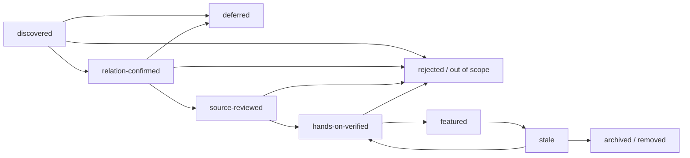

[English](./methodology.md) | [简体中文](./methodology.zh-CN.md)

# Research and inclusion methodology

<!-- sync:method-purpose -->

This repository curates practices, not popularity. A recommendation must tell a
reader what to do, why it reduces a real failure mode, how to verify it, and
which evidence supports it. Search results, stars, downloads, and catalog
presence are discovery signals only.

Research snapshot: **2026-07-31**.

## Research questions

<!-- sync:method-questions -->

The initial research answered:

1. What does Pi v0.83.0 actually guarantee?
2. Which behaviors exist only on post-release `main` or are explicitly
   experimental?
3. Where are the execution, trust, credential, and supply-chain boundaries?
4. How should users manage context, sessions, models, retries, and output?
5. When should a workflow use a context file, prompt, skill, extension,
   package, JSON, RPC, or SDK?
6. Which failure clusters recur in the public issue corpus?
7. Which existing directories already cover Pi packages, and what gap remains?
8. Which community implementations deserve hands-on evaluation?
9. What evidence and bilingual controls make the collection maintainable?

## Source hierarchy

<!-- sync:method-sources -->

| Tier | Source | Permitted use |
| --- | --- | --- |
| A | Tagged Pi source, release artifact, official documentation, official RFC, npm registry metadata. | Stable fact when pinned to a version and not contradicted by code. |
| B | Pi `main` at a full commit, official examples, maintainer blog posts. | Discovery, implementation detail, or explicit `main-only`/example context. |
| C | Third-party source, repository code, issue, pull request, package metadata. | Community behavior and candidate review; never an upstream guarantee. |
| D | Search snippet, stars, downloads, forks, automated summary, generated catalog text. | Discovery only; must be replaced by a stronger source before a claim or recommendation. |

When documentation and tagged implementation differ, record the mismatch and
scope the claim to observed code. A repository example is evidence that a
pattern can be implemented, not proof that Pi includes the feature by default.

## Search coverage

<!-- sync:method-coverage -->

The first pass covered:

- the Pi monorepo root, primary packages, coding-agent documentation, examples,
  tests, changelog, releases, security model, and contribution policy;
- `pi.dev` documentation and the package catalog;
- the Earendil RFC index and Pi-related RFC states;
- registry metadata for current `@earendil-works/*` packages;
- public issue and pull-request search by provider, authentication, extension,
  package, session, compaction, Windows, terminal, timeout, sandbox, and
  permission terms;
- GitHub repository search for packages, extensions, skills, integrations,
  sandboxes, front ends, and existing awesome/wiki directories;
- the Awesome Manifesto, list-creation guide, current pull-request template,
  and `awesome-lint` behavior;
- historical names (`badlogic/pi-mono`, `@mariozechner/*`) needed to interpret
  older articles after the 2026 scope migration.

Ongoing ecosystem discovery additionally searches current and historical Pi
package identities in dependency manifests, lockfiles, imports, RPC/JSON/ACP
call sites, repository redirects, fork/adaptation notices, and
`THIRD_PARTY_NOTICES`. This is necessary to find downstream products whose
name does not contain `pi`, indirect protocol consumers, alternate
distributions, and projects that internalized Pi-derived code.

Search coverage is not a claim that every repository or issue was read. It is a
documented funnel from broad discovery to source review.

Exact endpoints, query strings, captured totals, immutable refs, and known
sampling limits are preserved in the [query log](query-log.md) and
[machine-readable snapshot](../../data/research-snapshot-2026-07-31.json).
Unreviewed leads are preserved separately in the
[discovery candidate registry](../../data/discovery-candidates.json) under the
[replayable discovery protocol](discovery-protocol.md); the
[generated coverage summary](coverage-summary.md) reports category and
architecture gaps without upgrading candidates to reviewed evidence.

## Claim verification protocol

<!-- sync:method-verification -->

For every substantial claim:

1. Identify whether it is stable, main-only, experimental, community, or
   inference.
2. Prefer a tagged source or official page.
3. Save the full commit/tag, path, date, and relevant section.
4. Check adjacent implementation or tests for ambiguous security/protocol
   semantics.
5. Phrase only what the source proves.
6. Put synthesized advice behind an explicit inference label.
7. Add a falsifiable verification step to the practice.
8. Add the claim-source mapping to the evidence ledger.
9. Translate facts, version scope, and evidence status together.

Secrets, private issue content, personal contact data, and unpublished source
must not enter the research corpus.

## Recommendation lifecycle

<!-- sync:method-lifecycle -->

The states mean:

| State | Minimum evidence | Where it appears |
| --- | --- | --- |
| `discovered` | Search result or referral with canonical identity, source, snapshot, and provisional relation. | Discovery candidate registry. |
| `relation-confirmed` | Primary evidence confirms how the candidate relates to Pi, without completing the full source gate. | Discovery candidate registry and source-review queue. |
| `source-reviewed` | Purpose, code, license, maintenance, dependency, and obvious risk reviewed. | Community watchlist. |
| `hands-on-verified` | Named human, Pi version, platform, date, steps, expected/actual result, and cleanup recorded from direct execution. | Candidate for formal curation. |
| `featured` | Hands-on result plus maintainer judgment that it is unusually useful, maintained, documented, and appropriately licensed. | Root README. |
| `stale` | Verification window expired or material compatibility/security state changed. | Removed from root pending retest. |
| `rejected` | Out of scope, duplicate, unlicensed, unsafe without adequate disclosure, unverifiable, abandoned, or low-value. | Optional decision record, not a public shame list. |

The initial repository is an **AI-assisted research preview**. Source review
does not imply hands-on verification or endorsement. No third-party project is
featured until a named human maintainer completes the trial record and rewrites
the recommendation from direct experience.

## Evaluation rubric

<!-- sync:method-rubric -->

Hands-on candidates are evaluated on a 0–2 scale for each dimension:

| Dimension | 0 | 1 | 2 |
| --- | --- | --- | --- |
| Relevance | Adjacent only. | Useful to a narrow Pi workflow. | Directly solves an important Pi practice. |
| Reproducibility | No runnable path. | Partial or environment-specific steps. | Pinned, repeatable setup and verification. |
| Safety clarity | Hidden or misleading effects. | Effects mentioned incompletely. | Permissions, data, network, cleanup, and limits explicit. |
| Evidence | Marketing/readme assertion only. | Source or example supports core behavior. | Source, tests, and a recorded hands-on result agree. |
| Maintenance | Archived/stale/incompatible. | Unclear cadence or single-maintainer risk. | Current Pi compatibility and responsive maintenance demonstrated. |
| Documentation | Missing. | Basic setup. | Architecture, configuration, failures, removal, and examples covered. |
| Portability | Undisclosed assumptions. | One documented platform/provider. | Compatibility matrix or intentionally bounded scope. |
| License | Missing/incompatible. | Present but reuse boundary unclear. | OSI/recognized license and dependency/artifact boundary clear. |

A score is a review aid, not an automatic ranking. A serious credential,
integrity, licensing, or deceptive-behavior issue blocks featuring regardless of
the total. Popularity never contributes points.

## Practice inclusion criteria

<!-- sync:method-inclusion -->

A numbered practice must:

- address a Pi-specific or materially Pi-shaped failure mode;
- be actionable without requiring one vendor or one paid model unless clearly
  scoped;
- have a reproducible verification step;
- distinguish upstream behavior from local inference;
- cite primary evidence where primary evidence exists;
- state security and data consequences;
- avoid duplicating official documentation without adding an operational
  decision or check;
- remain meaningful across more than one small patch release, or declare a
  narrow version window;
- have fact-equivalent English and Simplified Chinese text.

Items are excluded from the formal practice set when they are merely:

- package discovery links;
- generic prompting slogans;
- unexplained dotfiles;
- popularity rankings;
- benchmarks without a reproducible setup and limitations;
- generated summaries with no source verification;
- promotional, sponsored, or affiliate placement;
- instructions that conceal destructive, credential, or data-transfer effects.

## Bilingual parity

<!-- sync:method-bilingual -->

English is the canonical Awesome-list entry point; Simplified Chinese is a
fact-equivalent peer, not a shortened summary. `sync:` markers enforce section
identity and order. Resource IDs enforce list membership and status. Human
review must still compare:

- version, commit, and date;
- stable/main-only/experimental labels;
- source-reviewed/hands-on/featured status;
- commands and flags;
- security qualifications;
- license and platform scope.

Scripts check structure; they do not claim to prove translation quality.

## AI and conflict-of-interest policy

<!-- sync:method-ai -->

AI may assist discovery, summarization, translation, consistency checks, and
drafting during the research-preview phase. It may not be used to claim
hands-on testing, invent citations, fabricate maintainer consensus, or submit
unreviewed changes. A human contributor must inspect every changed claim, link,
command, and translation.

Contributors disclose ownership, employment, sponsorship, consulting, or other
material relationships with a candidate. There is no paid placement, sponsored
ranking, or popularity-based priority. A conflicted maintainer should not be
the sole reviewer.

The central `sindresorhus/awesome` project currently rejects AI-generated lists
and fully AI-generated pull requests. Transparent AI disclosure is necessary
for this repository, but it is not an exemption. Submission to the central
list can be considered only after substantive, independently reviewable human
curation and at least the project's required public age.

## Quantitative snapshot rules

<!-- sync:method-numbers -->

Dynamic numbers always include:

- snapshot date and time zone;
- query or endpoint;
- exact interpretation;
- known overlap or sampling limitation;
- no conversion into a quality score.

Issue keyword counts overlap and are not prevalence percentages. GitHub “open
issues” may include pull requests unless the endpoint or query separates them.
Catalog filters may overlap because one package can contain multiple resource
types. Stars and forks can change immediately after capture.

## Update runbook

<!-- sync:method-update -->

For each quarterly review or Pi minor-version baseline change:

1. Capture the latest stable tag, release date, Node requirement, and root
   package list.
2. Run the [discovery protocol](discovery-protocol.md), preserving exact raw
   result identifiers, redirects/aliases, and a disposition for every result.
3. Diff the previous tag against the new tag for documentation, CLI options,
   settings schema, security, session, package, extension, RPC, SDK, and model
   behavior.
4. Recheck all `main-only` claims; promote, revise, or remove them.
5. Re-run issue-cluster queries and record counts without overwriting the prior
   snapshot.
6. Recheck every featured/watchlist repository's license, archive state,
   default branch, latest activity, Pi dependency scope, tests, CI, and security
   boundary.
7. Reconcile every active discovery candidate: retain it with a reason, reject
   it with immutable evidence, or promote it only after the next gate passes.
8. Expire hands-on records when their Pi baseline or critical dependency is no
   longer representative.
9. Regenerate machine coverage, then update English and Chinese peers in one
   change.
10. Run local checks, review link-check exceptions, and manually inspect the
   rendered root files.
11. Record reviewer identity, date, and material decisions.

## Limitations

<!-- sync:method-limits -->

- The public issue corpus overrepresents users who encountered and reported a
  problem; keyword search also produces false positives and overlapping hits.
- Repository metadata cannot prove code quality, safety, or real-world utility.
- Source review cannot reveal every runtime side effect or compromised
  dependency.
- Provider behavior can change server-side without a Pi release.
- Official `latest` pages can move; pinned source can become obsolete.
- A candidate registry makes omissions and dispositions auditable; it still
  cannot prove that ecosystem discovery has perfect recall.
- The initial community watchlist has not been endorsed through direct
  maintainer use.
- Chinese technical vocabulary intentionally retains some English Pi terms to
  avoid inventing meanings that differ from upstream identifiers.
