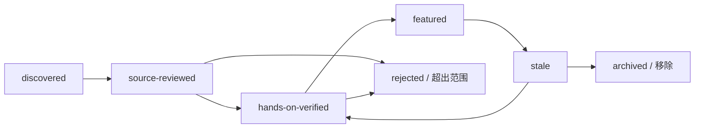

[English](./methodology.md) | [简体中文](./methodology.zh-CN.md)

# 研究与收录方法

<!-- sync:method-purpose -->

本仓库策展的是实践，不是流行度。一条建议必须告诉读者：应该做什么、为什么能减少
真实失败模式、如何验证，以及什么证据支持它。搜索结果、Stars、下载量和目录收录
都只能作为发现信号。

研究快照：**2026-07-31**。

## 研究问题

<!-- sync:method-questions -->

首轮研究回答：

1. Pi v0.83.0 实际保证了什么？
2. 哪些行为只存在于发布后的 `main`，或被明确标为实验性？
3. 执行、信任、凭据与供应链边界在哪里？
4. 用户应如何管理上下文、Session、模型、Retry 和输出？
5. 工作流何时应使用 Context File、Prompt、Skill、Extension、Package、JSON、
   RPC 或 SDK？
6. 公开 Issue 语料中反复出现哪些失败簇？
7. 哪些现有目录已经覆盖 Pi Package，还剩什么空白？
8. 哪些社区实现值得 Hands-on Evaluation？
9. 什么证据与双语控制能让本集合可维护？

## 来源层级

<!-- sync:method-sources -->

| 层级 | 来源 | 允许用途 |
| --- | --- | --- |
| A | Pi Tag 源码、Release Artifact、官方文档、官方 RFC、npm Registry Metadata。 | 固定版本且不与代码矛盾时，可作为稳定事实。 |
| B | 固定完整 Commit 的 Pi `main`、官方 Example、维护者 Blog。 | 发现、实现细节，或明确的“仅 main”/示例上下文。 |
| C | 第三方来源、仓库代码、Issue、PR、Package Metadata。 | 社区行为和候选审查；绝不能视为上游保证。 |
| D | Search Snippet、Stars、下载、Fork、自动摘要、生成式目录文本。 | 仅用于发现；成为结论或推荐前必须换成更强来源。 |

当文档与 Tag 实现不一致时，记录差异，并把结论限制在观察到的代码范围。仓库示例
只能证明某 Pattern 可以实现，不能证明 Pi 默认内建该功能。

## 搜索覆盖

<!-- sync:method-coverage -->

首轮搜索覆盖：

- Pi Monorepo Root、主要 Package、Coding-agent 文档、Example、Test、Changelog、
  Release、Security Model 与 Contribution Policy；
- `pi.dev` 文档与 Package Catalog；
- Earendil RFC 索引与 Pi 相关 RFC 状态；
- 当前 `@earendil-works/*` Package 的 Registry Metadata；
- 按 Provider、Authentication、Extension、Package、Session、Compaction、
  Windows、Terminal、Timeout、Sandbox 与 Permission 关键词进行的公开 Issue/PR
  搜索；
- 面向 Package、Extension、Skill、Integration、Sandbox、Frontend 和现有
  Awesome/Wiki 目录的 GitHub Repository Search；
- Awesome Manifesto、列表创建指南、当前 PR Template 与 `awesome-lint` 行为；
- 解释 2026 Scope Migration 前旧文章所需的历史名称（`badlogic/pi-mono`、
  `@mariozechner/*`）。

“覆盖”不表示每个仓库或 Issue 都被完整阅读；它记录从宽泛发现到源码审查的漏斗。

精确 Endpoint、Query String、捕获总数、Immutable Ref 与已知 Sampling Limit
保存在[查询日志](query-log.zh-CN.md)和
[机器可读快照](../../data/research-snapshot-2026-07-31.json)中。

## 结论验证协议

<!-- sync:method-verification -->

每条重要结论都执行：

1. 判断它属于稳定、仅 main、实验性、社区还是推论。
2. 优先采用 Tag Source 或官方页面。
3. 保存完整 Commit/Tag、Path、日期和相关章节。
4. 对含糊的安全/协议语义检查相邻实现或 Test。
5. 只表述来源确实证明的内容。
6. 综合建议显式标记为推论。
7. 为实践增加可证伪的 Verification Step。
8. 把 Claim-to-source Mapping 加入证据台账。
9. 一起翻译事实、版本范围与证据状态。

Secret、私有 Issue 内容、个人联系方式和未公开源码不得进入研究语料。

## 推荐生命周期

<!-- sync:method-lifecycle -->

各状态含义：

| 状态 | 最低证据 | 出现位置 |
| --- | --- | --- |
| `discovered` | 搜索结果或转介。 | 仅维护者笔记。 |
| `source-reviewed` | 已检查用途、代码、License、维护、Dependency 与明显风险。 | 社区观察名单。 |
| `hands-on-verified` | 记录具名人类、Pi 版本、平台、日期、步骤、预期/实际结果与清理。 | 正式策展候选。 |
| `featured` | 亲测结果 + 维护者判断其特别有用、持续维护、文档充分且 License 合适。 | 根 README。 |
| `stale` | 验证窗口到期，或兼容/安全状态发生重要变化。 | 从根文件移除，等待重测。 |
| `rejected` | 超范围、重复、无 License、不充分披露风险、不可验证、废弃或低价值。 | 可选决策记录，不做公开羞辱名单。 |

初始仓库是 **AI 辅助研究预览**。源码审查不等于亲测或背书。在具名人类维护者完成
试用记录，并依据直接体验重写推荐前，任何第三方项目都不会成为正式精选。

## 评估量表

<!-- sync:method-rubric -->

Hands-on Candidate 在每个维度按 0–2 评分：

| 维度 | 0 | 1 | 2 |
| --- | --- | --- | --- |
| 相关性 | 只是相邻主题。 | 对狭窄 Pi 工作流有用。 | 直接解决重要 Pi 实践。 |
| 可复现性 | 无可运行路径。 | 步骤不完整或绑定特定环境。 | 固定、可重复 Setup 与 Verification。 |
| 安全清晰度 | 隐藏或误导副作用。 | 不完整提到副作用。 | 权限、数据、网络、清理与限制清楚。 |
| 证据 | 只有营销/README 断言。 | 源码或示例支持核心行为。 | 源码、Test 与亲测记录一致。 |
| 维护 | Archived/过期/不兼容。 | 节奏不明或单维护者风险。 | 已证明当前 Pi 兼容性与响应性维护。 |
| 文档 | 缺失。 | 只有基本 Setup。 | 覆盖架构、配置、失败、移除与示例。 |
| 可移植性 | 未披露假设。 | 记录一个平台/Provider。 | 有 Compatibility Matrix 或明确限定范围。 |
| License | 缺失/不兼容。 | 存在，但复用边界不清。 | 认可 License，依赖/制品边界清楚。 |

评分是审查辅助，不是自动排名。严重的 Credential、Integrity、Licensing 或欺骗
行为会直接阻止精选，不论总分多高。流行度永不加分。

## 实践收录条件

<!-- sync:method-inclusion -->

编号实践必须：

- 处理 Pi 特定、或明显受 Pi 形态影响的失败模式；
- 除非明确限定，否则不要求单一 Vendor 或单一付费模型；
- 有可复现 Verification Step；
- 区分上游行为与本地推论；
- 有一手来源时引用一手来源；
- 写明安全与数据影响；
- 不简单重复官方文档，而要增加 Operational Decision 或 Check；
- 跨越不止一个小 Patch Release 仍有意义，否则声明狭窄版本窗口；
- 英文与简体中文事实等价。

以下内容不进入正式实践集：

- 只有 Package Discovery Link；
- 通用 Prompting 口号；
- 没有解释的 Dotfile；
- 流行度排名；
- 缺少可复现 Setup 与局限说明的 Benchmark；
- 未核验来源的生成式摘要；
- 推广、赞助或 Affiliate Placement；
- 隐瞒破坏性、Credential 或 Data-transfer Effect 的指令。

## 双语一致

<!-- sync:method-bilingual -->

英文是 Awesome List 的规范入口；简体中文是事实等价的同级版本，不是缩写摘要。
`sync:` Marker 保证 Section Identity 与顺序；Resource ID 保证列表成员与状态。
人类审查仍需比较：

- Version、Commit 与日期；
- Stable/Main-only/Experimental Label；
- Source-reviewed/Hands-on/Featured Status；
- Command 与 Flag；
- Security Qualification；
- License 与 Platform Scope。

Script 检查结构，不声称能证明翻译质量。

## AI 与利益冲突政策

<!-- sync:method-ai -->

研究预览阶段可以用 AI 辅助发现、摘要、翻译、一致性检查和 Draft。不得用 AI
冒充 Hands-on Test、伪造 Citation、虚构 Maintainer Consensus，或提交无人
审查的修改。人类贡献者必须检查每条修改后的结论、链接、命令和翻译。

贡献者需披露与候选项目的 Ownership、Employment、Sponsorship、Consulting 或
其他重要关系。本仓库没有付费展示、赞助排名或基于流行度的优先级。有利益冲突的
维护者不应成为唯一 Reviewer。

中央 `sindresorhus/awesome` 项目当前拒绝 AI-generated List 和 Fully
AI-generated PR。透明披露 AI 参与是本仓库的研究诚信要求，但不是豁免。只有产生
具有独立可审查性的实质人类策展，并达到上游要求的公开时间后，才能考虑向中央
列表提交。

## 定量快照规则

<!-- sync:method-numbers -->

动态数字始终记录：

- 快照日期与时区；
- Query 或 Endpoint；
- 精确解释；
- 已知重叠或 Sampling Limitation；
- 不转化为质量分。

Issue 关键词计数互相重叠，不是占比。GitHub “Open Issues” 可能包括 PR，除非
Endpoint/Query 明确区分。Catalog Filter 会重叠，因为一个 Package 可包含多种
Resource Type。Stars 与 Forks 在捕获后即可变化。

## 更新运行手册

<!-- sync:method-update -->

每次季度审查或 Pi Minor-version Baseline 变化时：

1. 捕获最新 Stable Tag、Release Date、Node Requirement 与 Root Package List。
2. 对上一 Tag 和新 Tag 做 Diff，检查 Documentation、CLI Option、Settings
   Schema、Security、Session、Package、Extension、RPC、SDK 与模型行为。
3. 复核所有“仅 main”结论，升级、修订或移除。
4. 重新运行 Issue-cluster Query，保留历史快照而不是覆盖旧数字。
5. 复查每个 Featured/Watchlist Repository 的 License、Archive State、
   Default Branch、最近活动、Pi Dependency Scope、Test、CI 与 Security
   Boundary。
6. 当 Pi Baseline 或 Critical Dependency 不再具有代表性时，过期 Hands-on
   Record。
7. 在同一修改中更新英文和中文文件。
8. 运行本地检查，Review Link-check Exception，并人工查看根文件渲染。
9. 记录 Reviewer Identity、日期与重要决定。

## 局限

<!-- sync:method-limits -->

- 公开 Issue 语料高估遇到且报告问题的用户；Keyword Search 也有 False Positive
  与重叠。
- Repository Metadata 无法证明代码质量、安全性或真实效用。
- Source Review 无法发现所有 Runtime Side Effect 或被入侵依赖。
- Provider Behavior 可在没有 Pi Release 的情况下从服务端变化。
- 官方 `latest` 页面会移动；Pinned Source 会过时。
- 初始社区观察名单尚未通过维护者直接使用获得背书。
- 中文技术词汇刻意保留部分英文 Pi 术语，以免发明与上游 Identifier 不同的含义。
